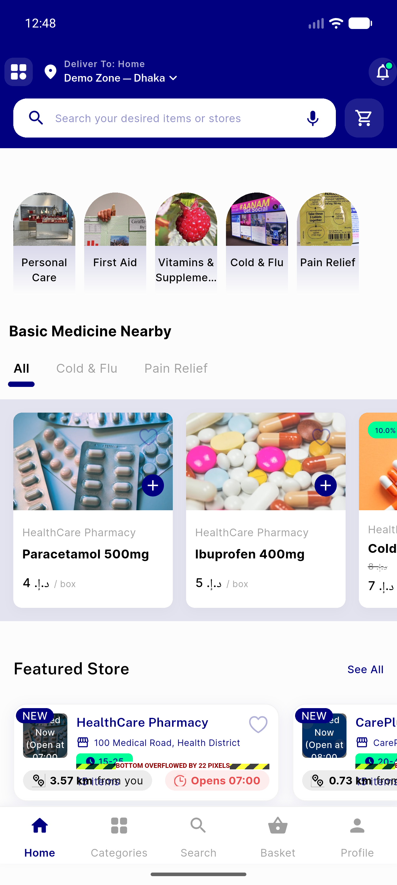
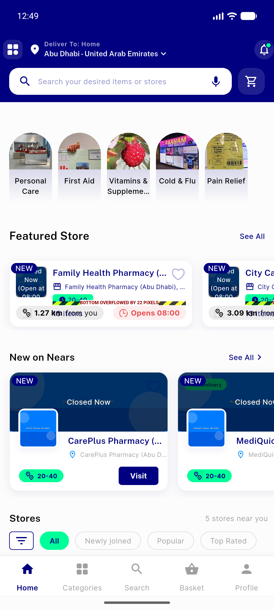

# QA Evidence — NEARS-260

**3 screenshot(s).** Click any thumbnail for full resolution.

<table>
<tr>
<td align="center" width="33%"> AC1 AC2 pharmacy zone1 basic medicine rail populated</td>
<td align="center" width="33%"> AC3 pharmacy zone2 rail empty clean</td>
<td align="center" width="33%"> regression healthcare pharmacy store detail</td>
</tr>
</table>

### Other artifacts
- [`logcat_evidence.txt`](logcat_evidence.txt)

---
*From `nears/docs/qa-evidence/NEARS-260/` · public-repo scrub policy (no live secrets; verified clean).*
