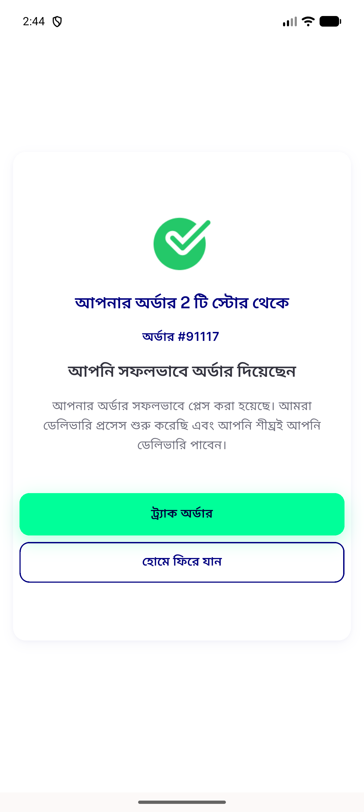
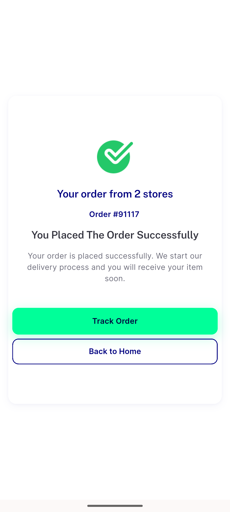
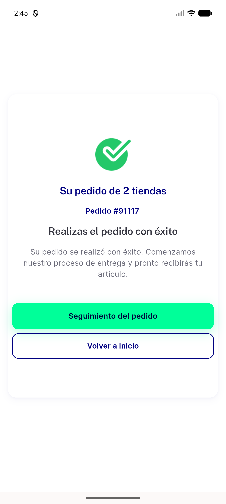

# QA Evidence — NEARS-2601

**PASS - NEARS-2601 i18n order_from_n_stores bn/es keys, live-rendered via existing multi-store order 91117**

**3 screenshot(s).** Click any thumbnail for full resolution.

<table>
<tr>
<td align="center" width="33%"> order successful bn</td>
<td align="center" width="33%"> order successful en baseline</td>
<td align="center" width="33%"> order successful es</td>
</tr>
</table>

---
*From `nears/docs/qa-evidence/NEARS-2601/` · public-repo scrub policy (no live secrets; verified clean).*
