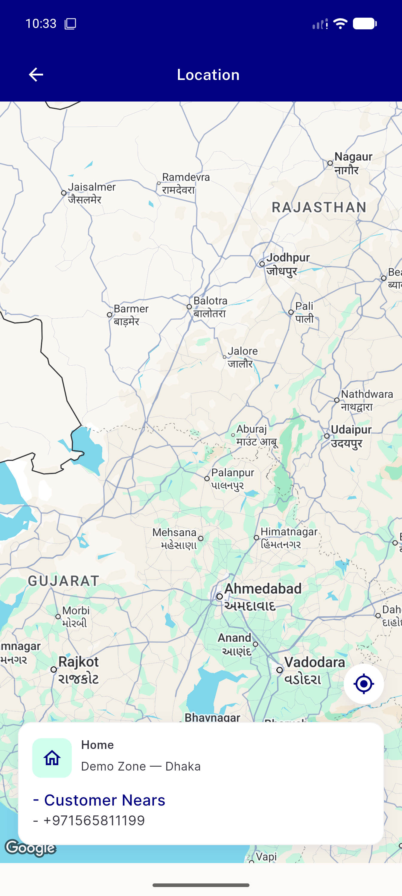
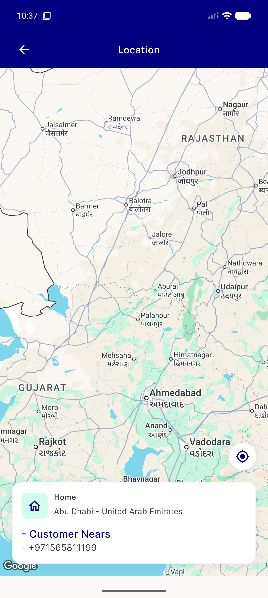

# QA Evidence — NEARS-2602

**PASS — NEARS-2602 map bounds null-address fix: both live cases render without throwing (2/2 unit tests green, no crash logs on device).**

**3 screenshot(s).** Click any thumbnail for full resolution.

<table>
<tr>
<td align="center" width="33%"> ac2 crash case map both markers</td>
<td align="center" width="33%"> ac2 crash case map renders initial</td>
<td align="center" width="33%"> ac3 regression case map renders</td>
</tr>
</table>

---
*From `nears/docs/qa-evidence/NEARS-2602/` · public-repo scrub policy (no live secrets; verified clean).*
