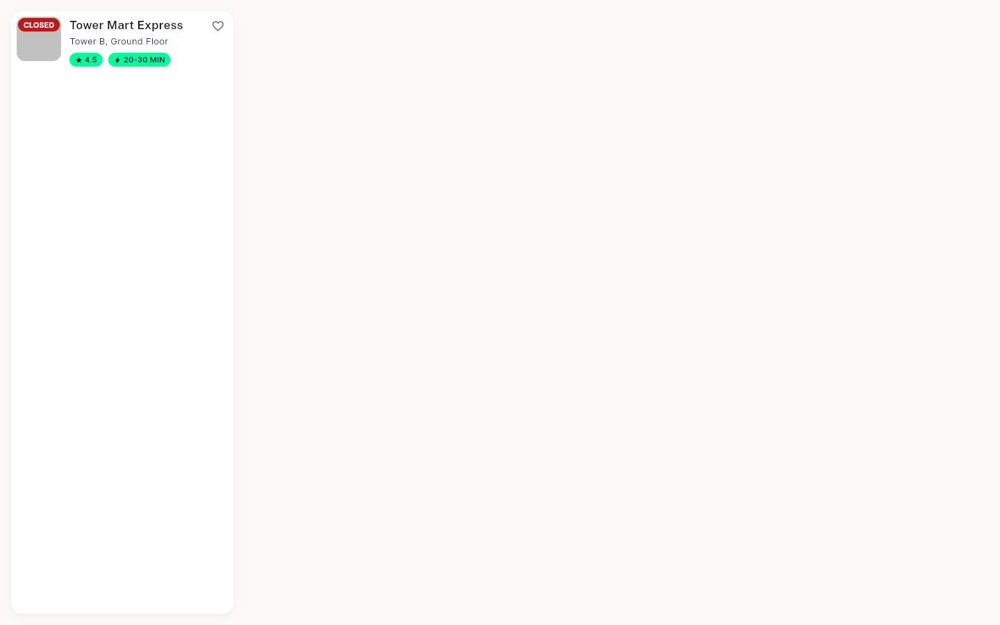
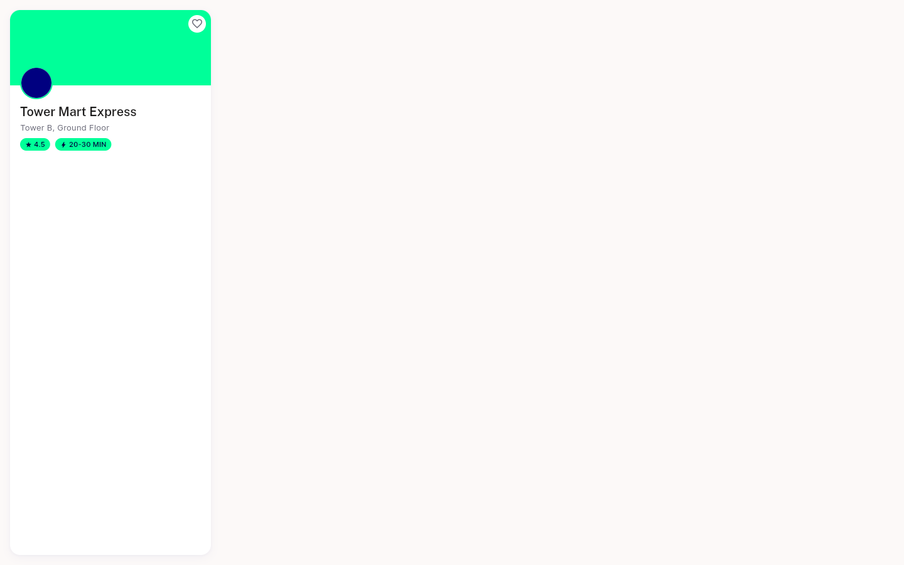

# QA Evidence — NEARS-2603

**PASS - NStoreCard badge semantics natural-case a11y labels**

**2 screenshot(s).** Click any thumbnail for full resolution.

<table>
<tr>
<td align="center" width="33%"> ac2 closed chip row</td>
<td align="center" width="33%"> ac3 rating chip stacked</td>
</tr>
</table>

---
*From `nears/docs/qa-evidence/NEARS-2603/` · public-repo scrub policy (no live secrets; verified clean).*
