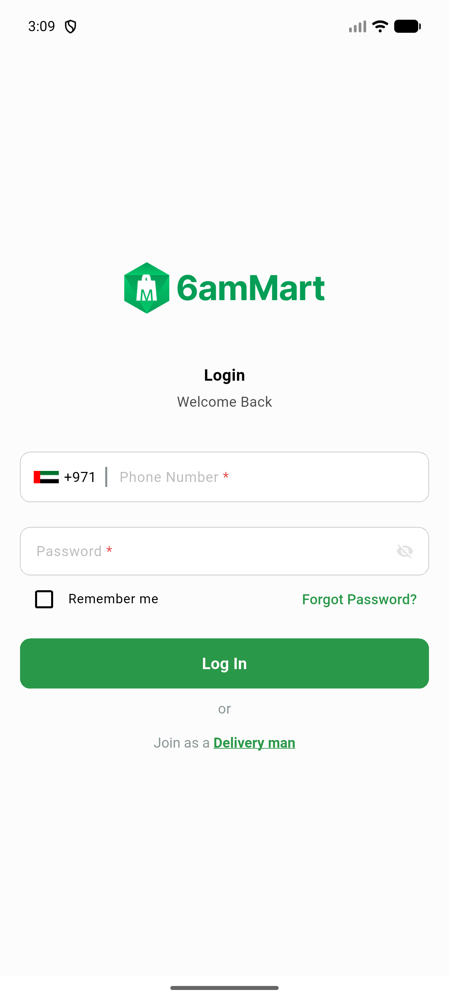
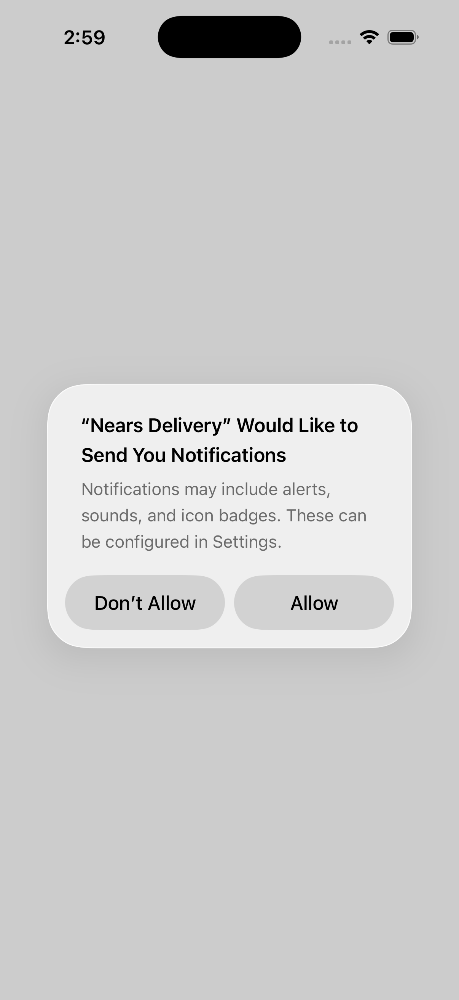
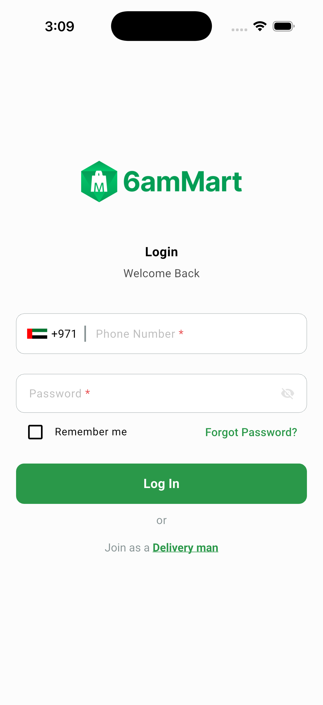

# QA Evidence — NEARS-2604

**BLOCKED — Android regression clean (manual+401 logout, token cleared, no crash); iOS AC1 code-confirmed + partial-live only, full interactive demo blocked by a host touch-delivery tooling gap (documented)**

**3 screenshot(s).** Click any thumbnail for full resolution.

<table>
<tr>
<td align="center" width="33%"> android 401 autologout signin</td>
<td align="center" width="33%"> ios notification permission precondition</td>
<td align="center" width="33%"> ios signin reached no crash</td>
</tr>
</table>

---
*From `nears/docs/qa-evidence/NEARS-2604/` · public-repo scrub policy (no live secrets; verified clean).*
