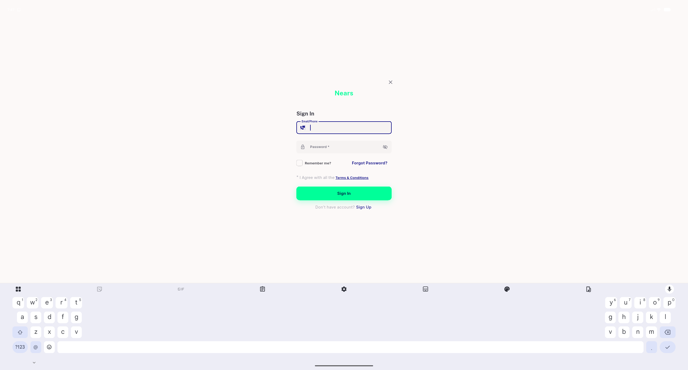
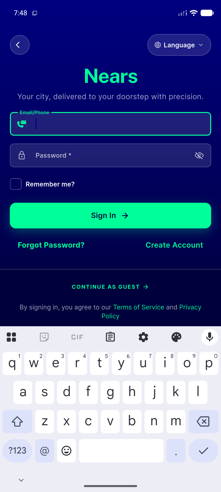

# QA Evidence — NEARS-2607

**PASS: NEARS-2607 fix-cycle1 — desktop Forgot Password confirmed navy/primaryColor parity with Sign Up sibling; forgot-password dialog still opens; mobile hero mint call sites unaffected**

**2 screenshot(s).** Click any thumbnail for full resolution.

<table>
<tr>
<td align="center" width="33%"> ac1 desktop forgot password navy</td>
<td align="center" width="33%"> regression mobile hero mint</td>
</tr>
</table>

---
*From `nears/docs/qa-evidence/NEARS-2607/` · public-repo scrub policy (no live secrets; verified clean).*
