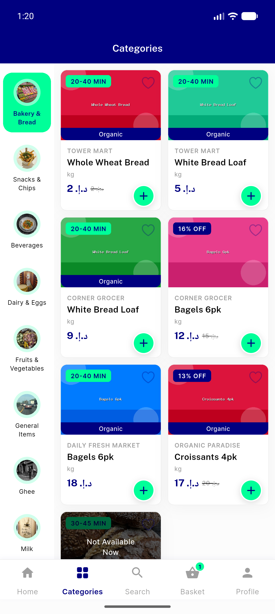
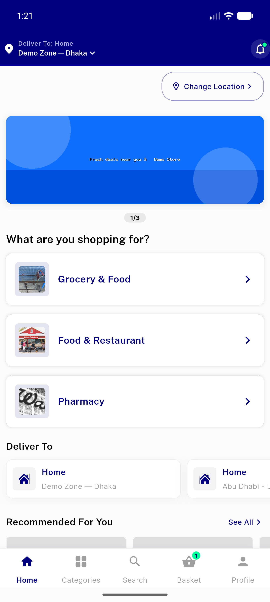
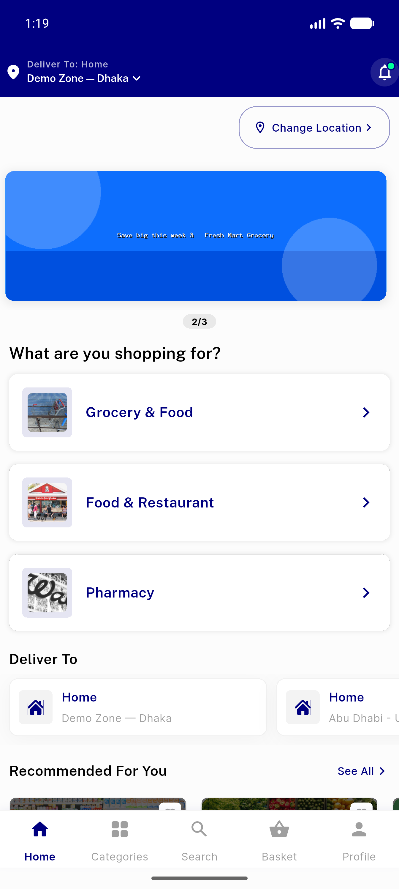
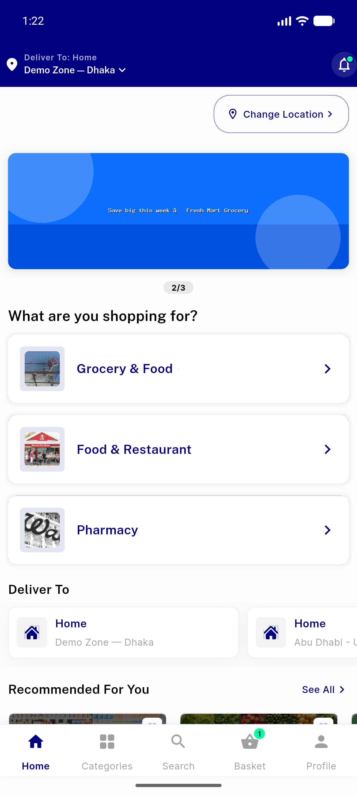
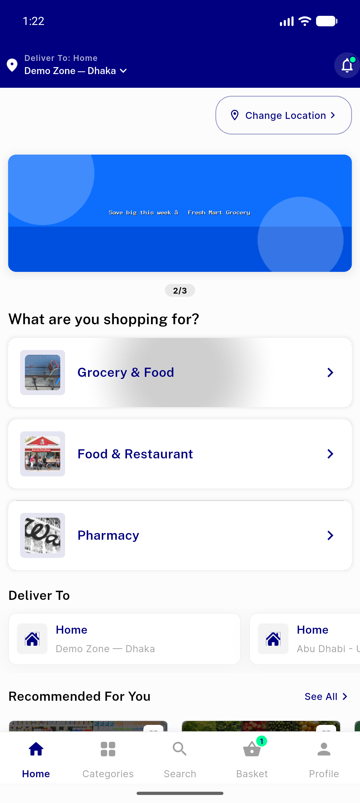
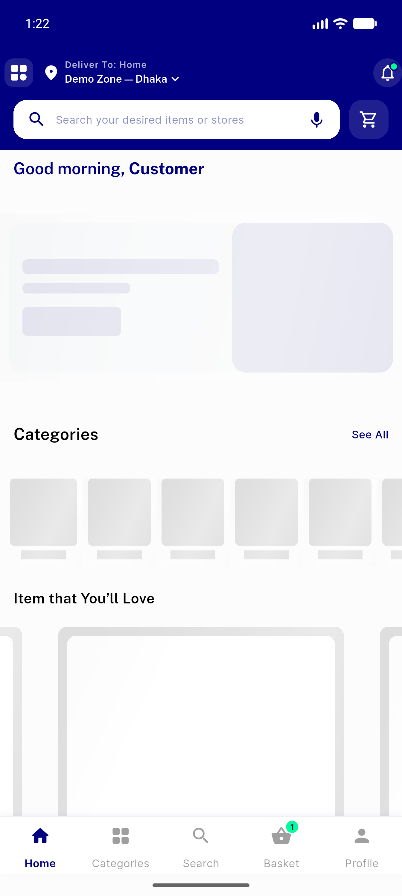
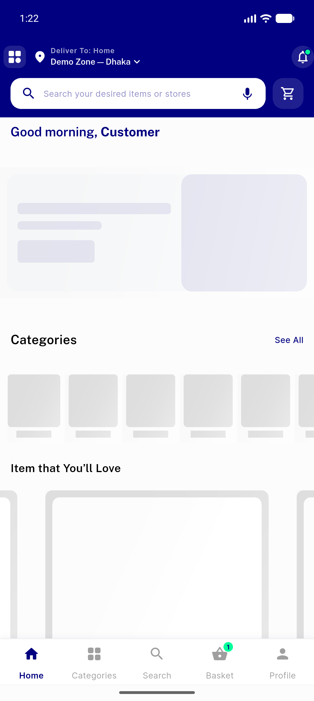
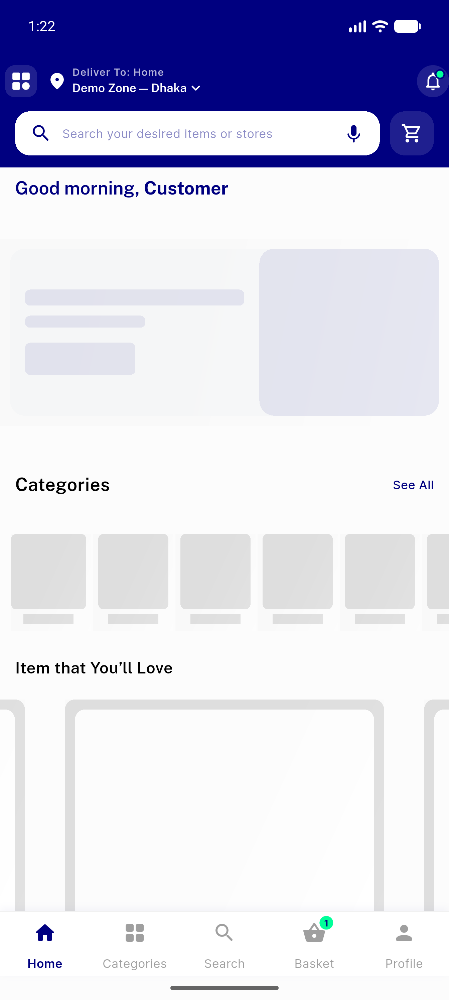
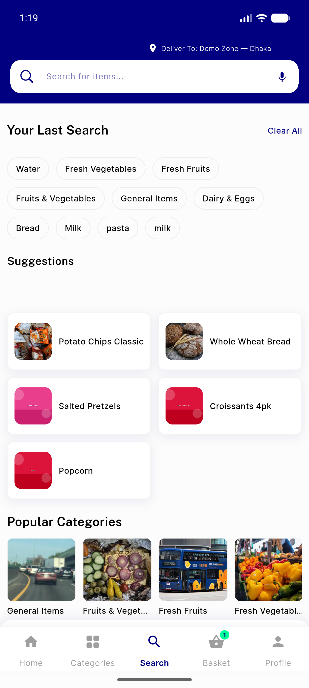
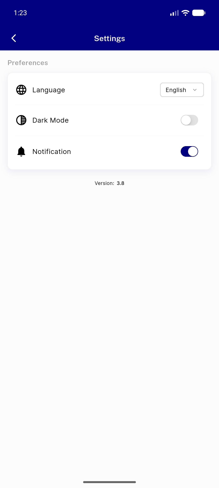

# QA Evidence — NEARS-261-252

**12 screenshot(s).** Click any thumbnail for full resolution.

<table>
<tr>
<td align="center" width="33%"> categories screen</td>
<td align="center" width="33%"> category shimmer</td>
<td align="center" width="33%"> category shimmer 2</td>
</tr>
<tr>
<td align="center" width="33%"> home arabic nav</td>
<td align="center" width="33%"> home dashboard</td>
<td align="center" width="33%"> module shimmer 1</td>
</tr>
<tr>
<td align="center" width="33%"> module shimmer 2</td>
<td align="center" width="33%"> module shimmer 3</td>
<td align="center" width="33%"> module shimmer 4</td>
</tr>
<tr>
<td align="center" width="33%"> module shimmer 5</td>
<td align="center" width="33%"> search screen</td>
<td align="center" width="33%"> settings screen</td>
</tr>
</table>

---
*From `nears/docs/qa-evidence/NEARS-261-252/` · public-repo scrub policy (no live secrets; verified clean).*
