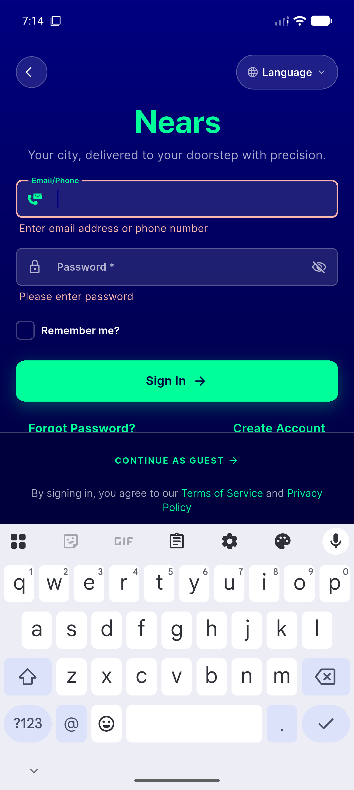
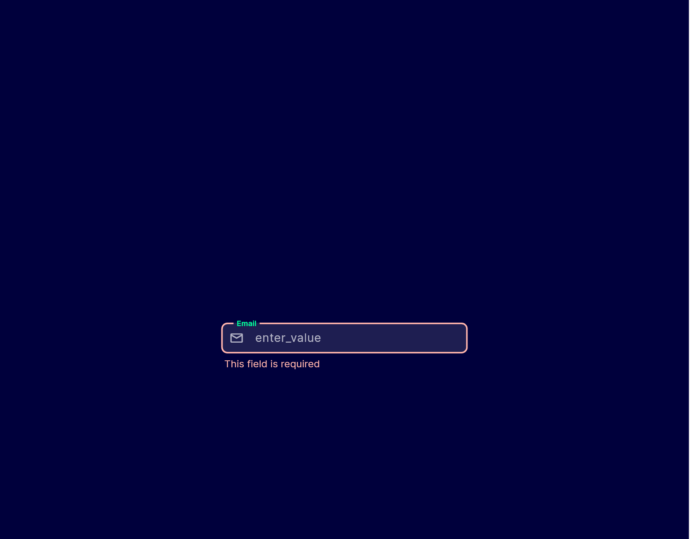
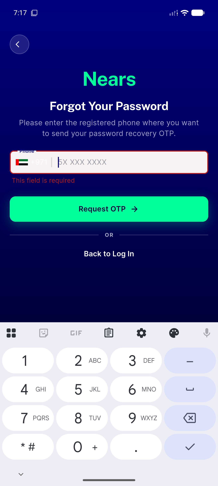
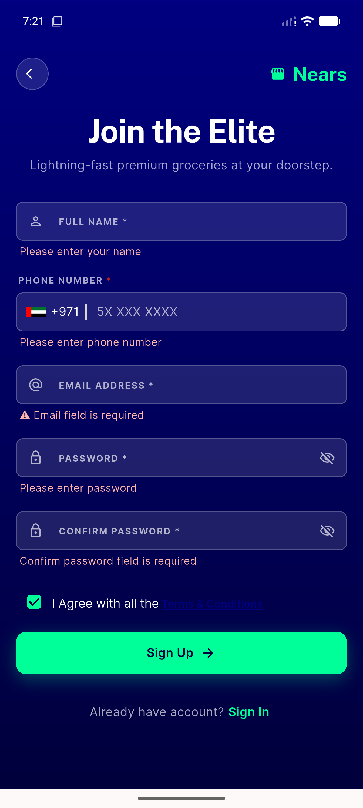

# QA Evidence — NEARS-2612

**PASS -- NInput secondary/glass error color now errorDark #FFB4AB, non-glass unchanged, widgetbook fixture untouched, 34/34 unit + live UserApp cross-checks green**

**4 screenshot(s).** Click any thumbnail for full resolution.

<table>
<tr>
<td align="center" width="33%"> ac1 live manual login error</td>
<td align="center" width="33%"> ac1 widgetbook secondary error focused</td>
<td align="center" width="33%"> regression forget pass secondary error</td>
</tr>
<tr>
<td align="center" width="33%"> regression sign up secondary error</td>
</tr>
</table>

---
*From `nears/docs/qa-evidence/NEARS-2612/` · public-repo scrub policy (no live secrets; verified clean).*
