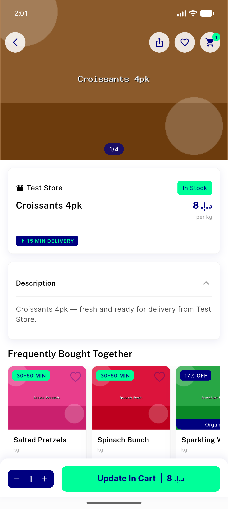
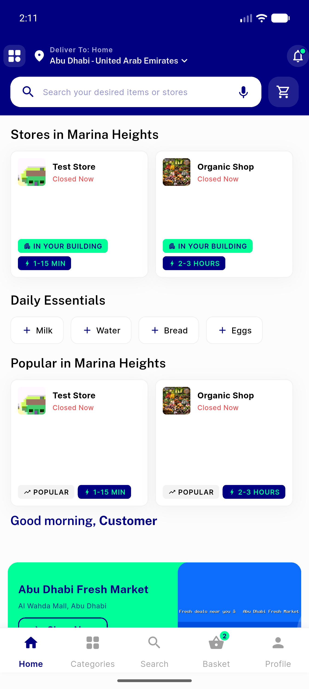

# QA Evidence — NEARS-262

**2 screenshot(s).** Click any thumbnail for full resolution.

<table>
<tr>
<td align="center" width="33%"> item detail cart</td>
<td align="center" width="33%"> store screen</td>
</tr>
</table>

### Other artifacts
- [`analytics_mirror_lines.txt`](analytics_mirror_lines.txt)

---
*From `nears/docs/qa-evidence/NEARS-262/` · public-repo scrub policy (no live secrets; verified clean).*
