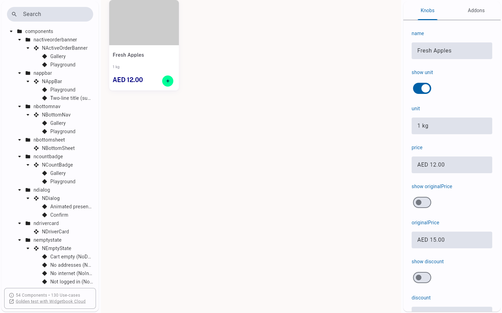

# QA Evidence — NEARS-2620

**PASS - AC3 semantics wired in Widgetbook Playground (n_item_card_stories.dart)**

**1 screenshot(s).** Click any thumbnail for full resolution.

<table>
<tr>
<td align="center" width="33%"> ac3 playground semantics</td>
</tr>
</table>

---
*From `nears/docs/qa-evidence/NEARS-2620/` · public-repo scrub policy (no live secrets; verified clean).*
