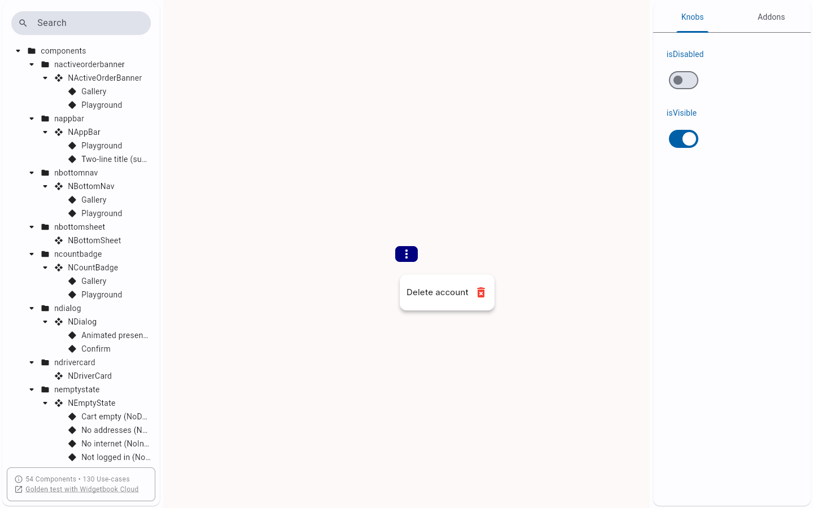

# QA Evidence — NEARS-2622

**PASS -- AC3 live: NPopupMenu Trigger use-case, labeled node role=button flt-tappable, tap opens menu cleanly**

**1 screenshot(s).** Click any thumbnail for full resolution.

<table>
<tr>
<td align="center" width="33%"> ac3 trigger tap opens menu</td>
</tr>
</table>

---
*From `nears/docs/qa-evidence/NEARS-2622/` · public-repo scrub policy (no live secrets; verified clean).*
