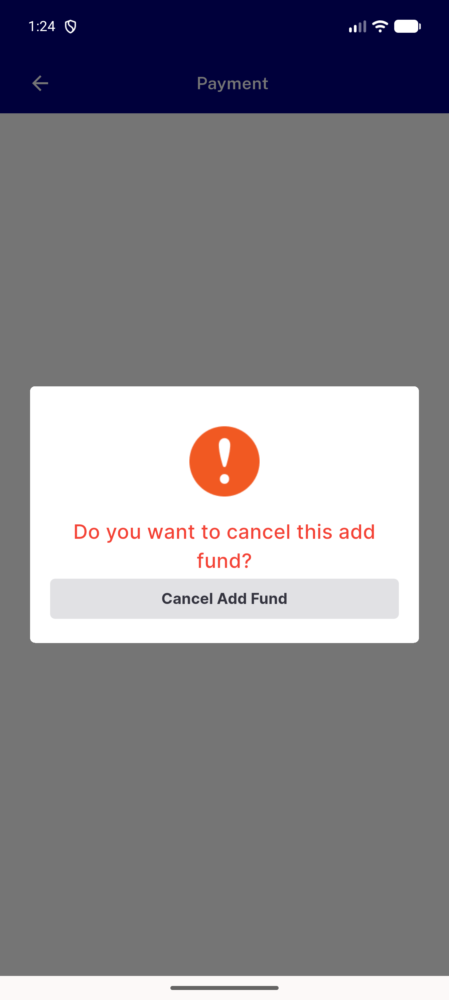

# QA Evidence — NEARS-2623

**BLOCKED: fix correct + automated 3/3, but PaymentWebViewScreen unreachable via live nav in this build (payInWevView=false, pre-existing)**

**1 screenshot(s).** Click any thumbnail for full resolution.

<table>
<tr>
<td align="center" width="33%"> sibling payment screen fund dialog</td>
</tr>
</table>

### Other artifacts
- [`ac4-net-log-full-session.log`](ac4-net-log-full-session.log)
- [`bug-fund-dialog-orphan-duplicate.log`](bug-fund-dialog-orphan-duplicate.log)
- [`finding-payment-webview-screen-unreachable.log`](finding-payment-webview-screen-unreachable.log)

---
*From `nears/docs/qa-evidence/NEARS-2623/` · public-repo scrub policy (no live secrets; verified clean).*
