# QA Evidence — NEARS-2626

**Delta re-QA cycle 2: FAIL - AR/RTL strike-through illegible on Cold & Flu Relief, Vitamin C 1000mg, Aspirin 100mg (row-branch); EN/LTR all clean; Digital Thermometer AR strike now legible**

**58 screenshot(s).** Click any thumbnail for full resolution.

<table>
<tr>
<td align="center" width="33%"><a href="ac1-ac2-en-bloodpressure-stacked-pass.png">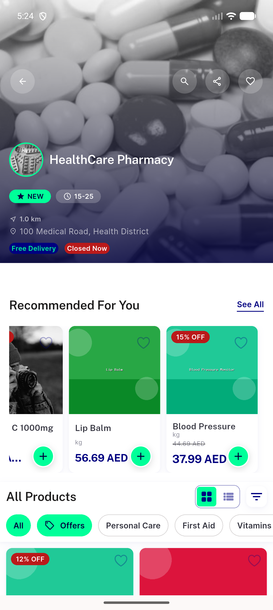</a> ac1 ac2 en bloodpressure stacked pass</td>
<td align="center" width="33%"> ac1 en coldflu full card</td>
<td align="center" width="33%"><a href="ac1-en-thermometer-full-card.png">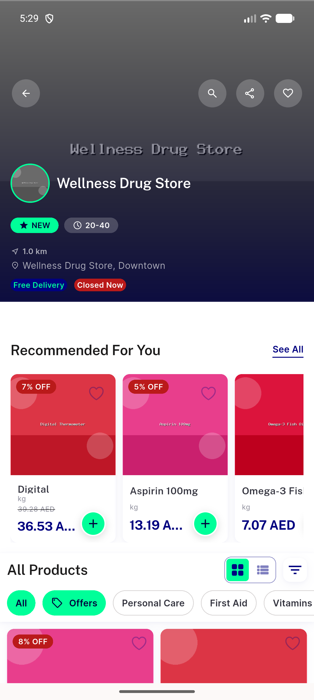</a> ac1 en thermometer full card</td>
</tr>
<tr>
<td align="center" width="33%"> ac4 ar bloodpressure fail full card</td>
<td align="center" width="33%"><a href="ac4-ar-coldflu-fail-full-card.png">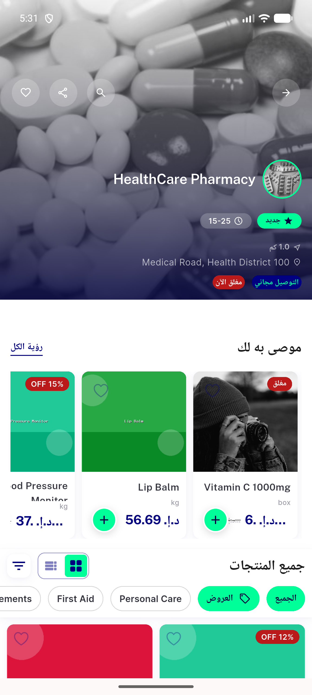</a> ac4 ar coldflu fail full card</td>
<td align="center" width="33%"> bug ar aspirin strike illegible cycle2</td>
</tr>
<tr>
<td align="center" width="33%"><a href="bug-ar-bloodpressure-truncation-zoom.png">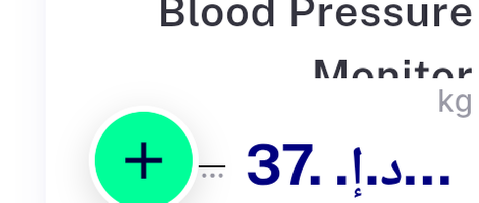</a> bug ar bloodpressure truncation zoom</td>
<td align="center" width="33%"> bug ar coldflu strike illegible cycle2</td>
<td align="center" width="33%"> bug ar coldflu truncation zoom</td>
</tr>
<tr>
<td align="center" width="33%"> bug ar vitaminc strike illegible cycle2</td>
<td align="center" width="33%"> bug en coldflu truncation zoom</td>
<td align="center" width="33%"><a href="bug-en-thermometer-clamp-zoom.png">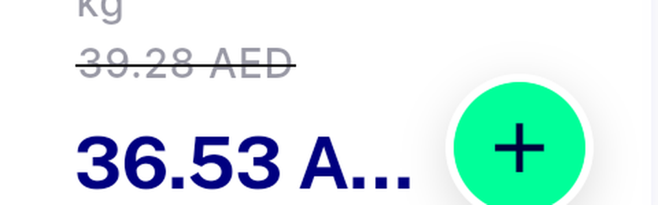</a> bug en thermometer clamp zoom</td>
</tr>
<tr>
<td align="center" width="33%"> bug en vitaminc truncation zoom</td>
<td align="center" width="33%"> cycle1 ac3 en aspirin pass zoom</td>
<td align="center" width="33%"><a href="cycle1-ac3-en-bloodpressure-regression-pass.png">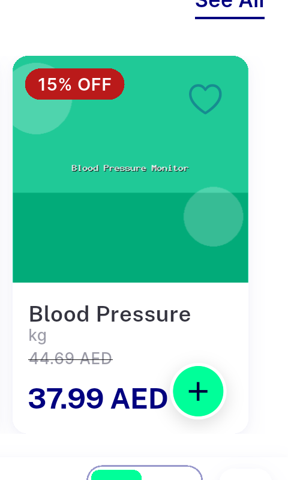</a> cycle1 ac3 en bloodpressure regression pass</td>
</tr>
<tr>
<td align="center" width="33%"><a href="cycle1-ac3-en-coldflu-pass.png">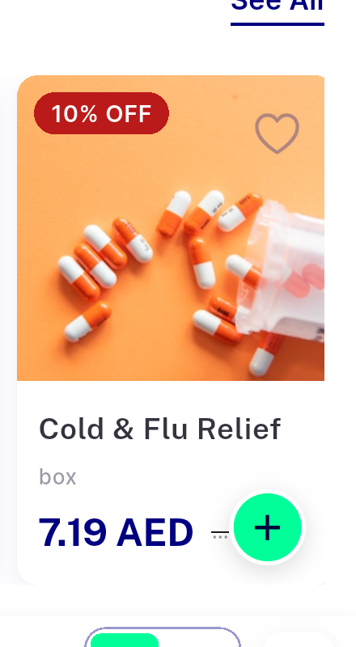</a> cycle1 ac3 en coldflu pass</td>
<td align="center" width="33%"><a href="cycle1-ac3-en-vitaminc-pass.png">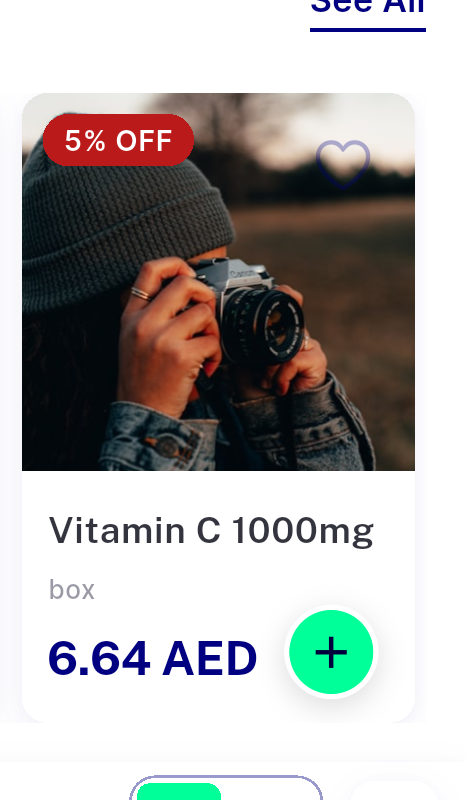</a> cycle1 ac3 en vitaminc pass</td>
<td align="center" width="33%"><a href="cycle1-ac4-ar-coldflu-pass.png">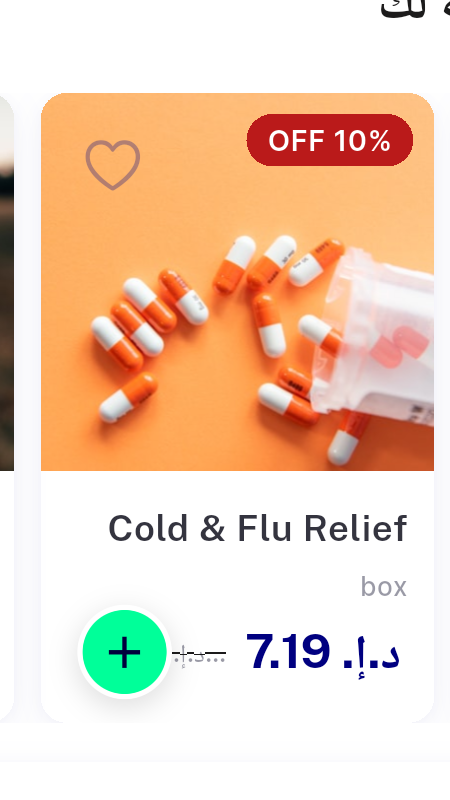</a> cycle1 ac4 ar coldflu pass</td>
</tr>
<tr>
<td align="center" width="33%"><a href="cycle1-ac4-ar-thermo-aspirin-full-card.png">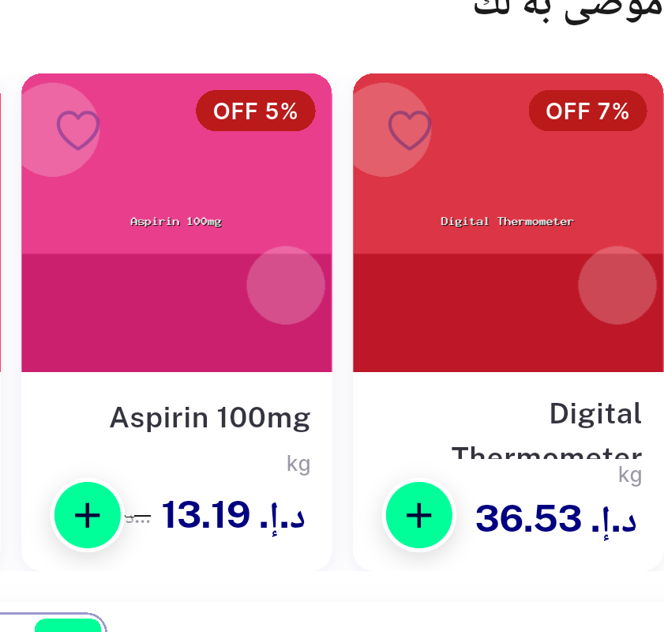</a> cycle1 ac4 ar thermo aspirin full card</td>
<td align="center" width="33%"><a href="cycle1-ac4-ar-vitaminc-pass.png">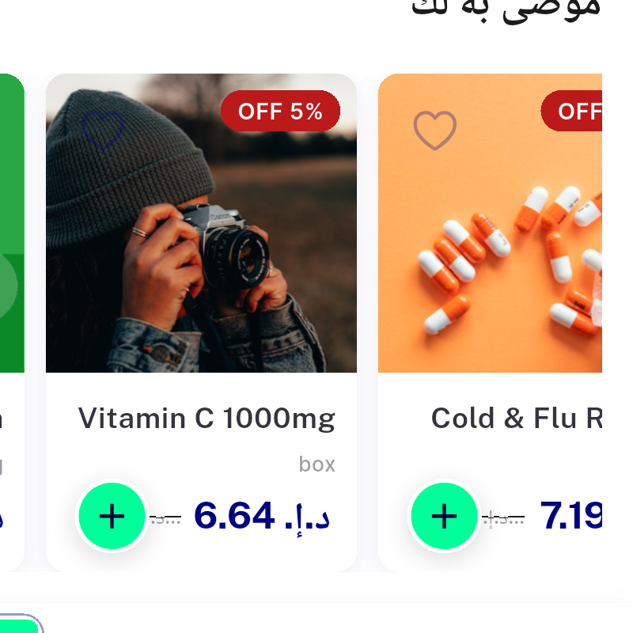</a> cycle1 ac4 ar vitaminc pass</td>
<td align="center" width="33%"><a href="cycle1-bug-ar-aspirin-strike-squeeze.png">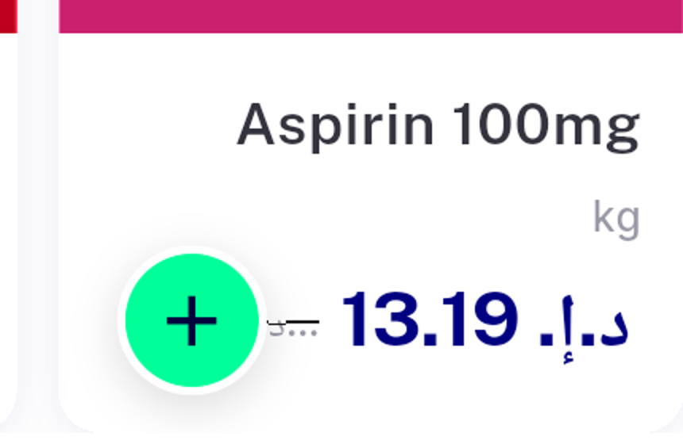</a> cycle1 bug ar aspirin strike squeeze</td>
</tr>
<tr>
<td align="center" width="33%"><a href="cycle1-bug-ar-thermometer-strike-missing.png">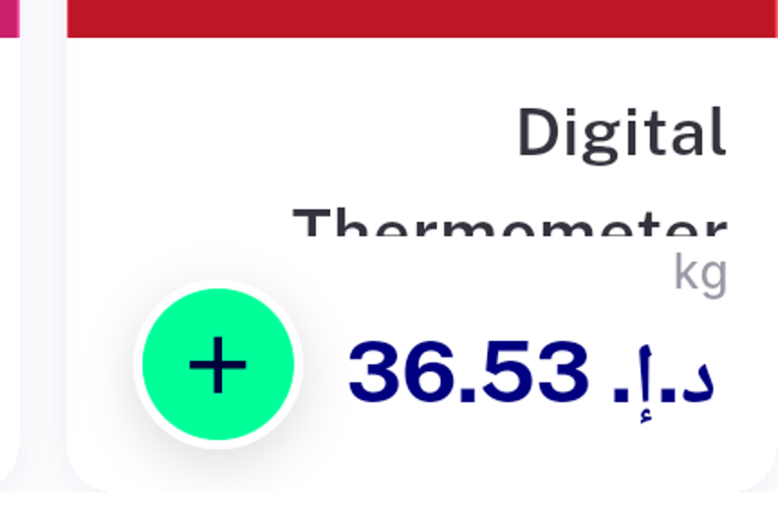</a> cycle1 bug ar thermometer strike missing</td>
<td align="center" width="33%"><a href="cycle1-bug-en-thermometer-truncation.png">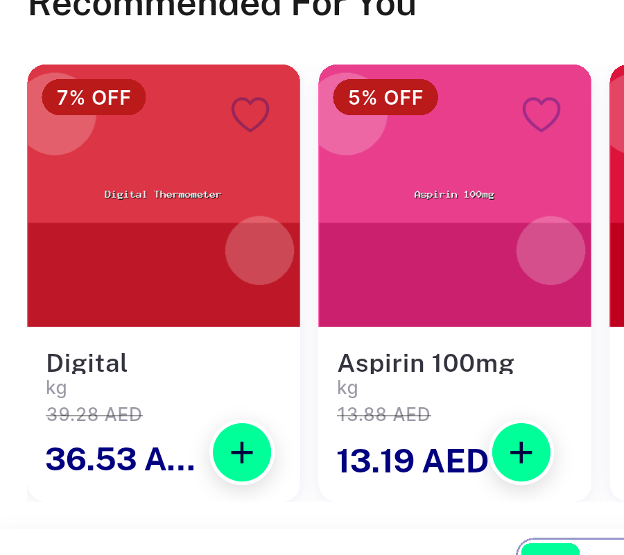</a> cycle1 bug en thermometer truncation</td>
<td align="center" width="33%"> cycle2 ar aspirin strike zoom</td>
</tr>
<tr>
<td align="center" width="33%"> cycle2 ar coldflu card</td>
<td align="center" width="33%"><a href="cycle2-ar-coldflu-full.png">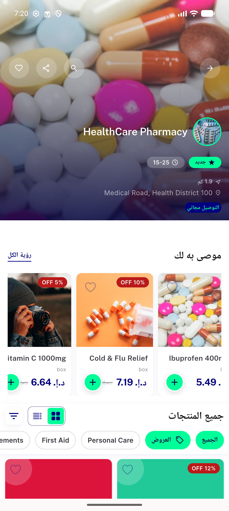</a> cycle2 ar coldflu full</td>
<td align="center" width="33%"><a href="cycle2-ar-pharmacyhome-debug.png">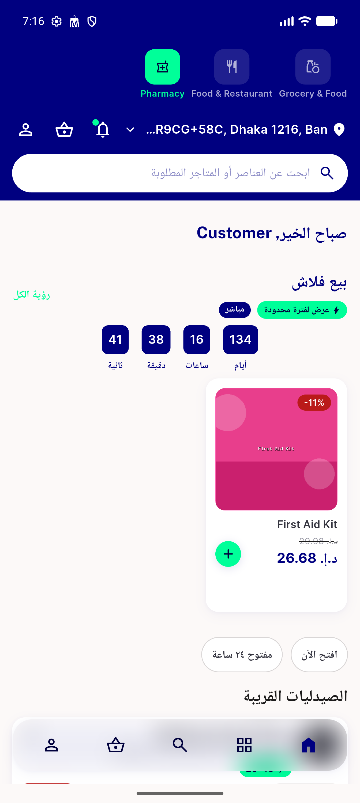</a> cycle2 ar pharmacyhome debug</td>
</tr>
<tr>
<td align="center" width="33%"><a href="cycle2-ar-pharmacyhome-scrolled.png">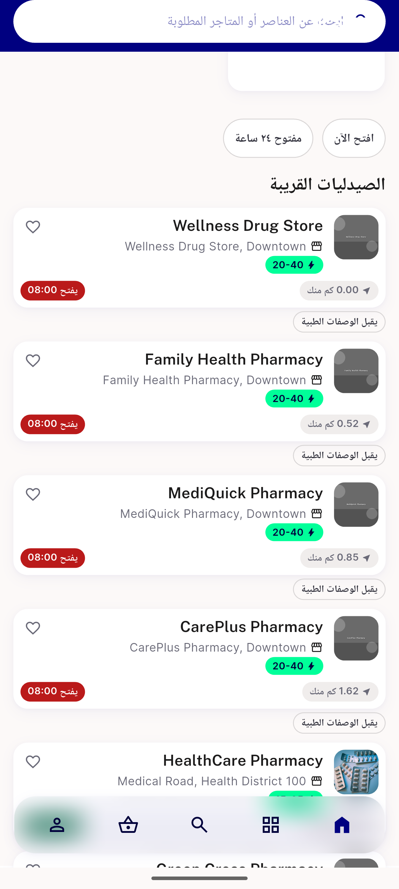</a> cycle2 ar pharmacyhome scrolled</td>
<td align="center" width="33%"> cycle2 ar store43 bothcards</td>
<td align="center" width="33%"> cycle2 ar store43 priceszoom</td>
</tr>
<tr>
<td align="center" width="33%"><a href="cycle2-ar-store43-top.png">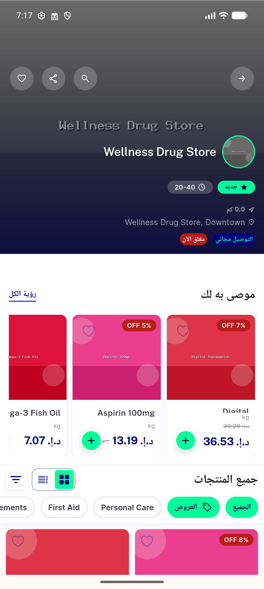</a> cycle2 ar store43 top</td>
<td align="center" width="33%"><a href="cycle2-ar-store7-coldflu.png">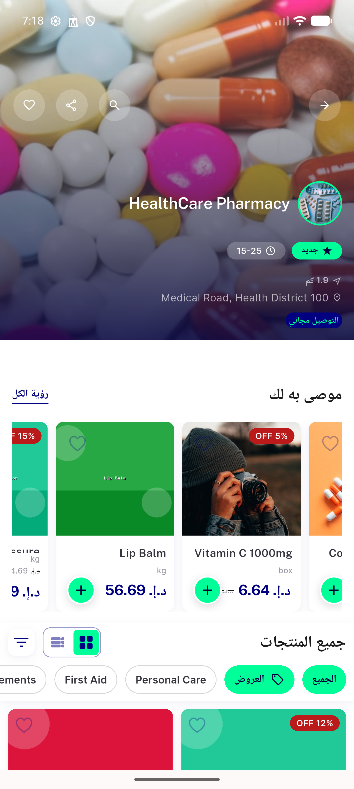</a> cycle2 ar store7 coldflu</td>
<td align="center" width="33%"><a href="cycle2-ar-store7-top.png">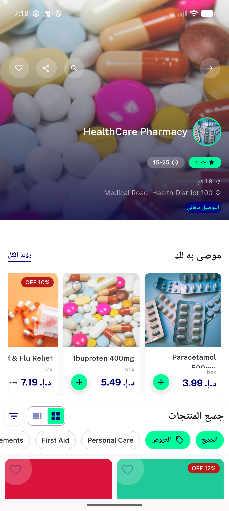</a> cycle2 ar store7 top</td>
</tr>
<tr>
<td align="center" width="33%"> cycle2 ar thermo strike zoom</td>
<td align="center" width="33%"><a href="cycle2-ar-vitaminc-card.png">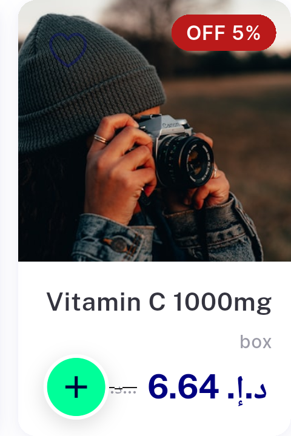</a> cycle2 ar vitaminc card</td>
<td align="center" width="33%"> cycle2 ar vitaminc strike zoom</td>
</tr>
<tr>
<td align="center" width="33%"> cycle2 en coldflu crop</td>
<td align="center" width="33%"> cycle2 en coldflu rail crop</td>
<td align="center" width="33%"><a href="cycle2-en-coldflu-search.png">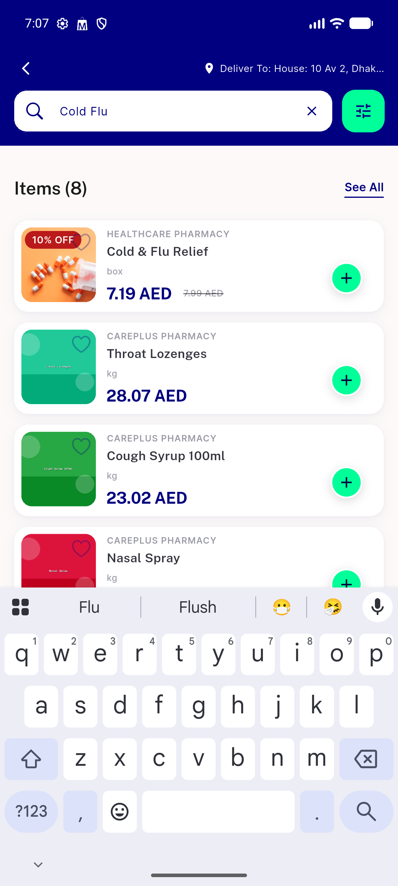</a> cycle2 en coldflu search</td>
</tr>
<tr>
<td align="center" width="33%"> cycle2 en store43 top</td>
<td align="center" width="33%"> cycle2 en store7 scrolled</td>
<td align="center" width="33%"> cycle2 en store7 top</td>
</tr>
<tr>
<td align="center" width="33%"> cycle2 en vitaminc exact</td>
<td align="center" width="33%"> cycle2 en vitaminc final</td>
<td align="center" width="33%"><a href="cycle2-en-vitaminc-fresh.png">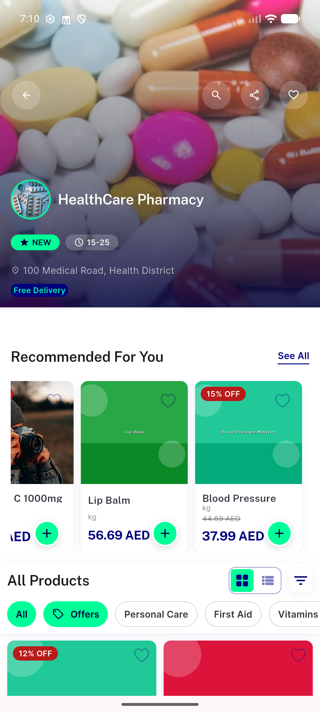</a> cycle2 en vitaminc fresh</td>
</tr>
<tr>
<td align="center" width="33%"><a href="cycle2-en-vitaminc-rail-crop.png">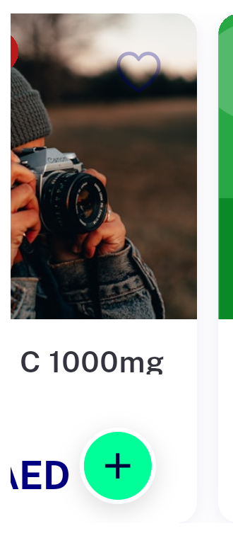</a> cycle2 en vitaminc rail crop</td>
<td align="center" width="33%"><a href="cycle2-en-vitaminc-rail-crop2.png">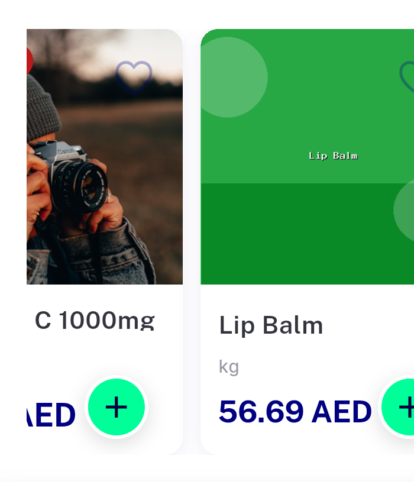</a> cycle2 en vitaminc rail crop2</td>
<td align="center" width="33%"><a href="pass-ar-thermometer-store43-cycle2.png">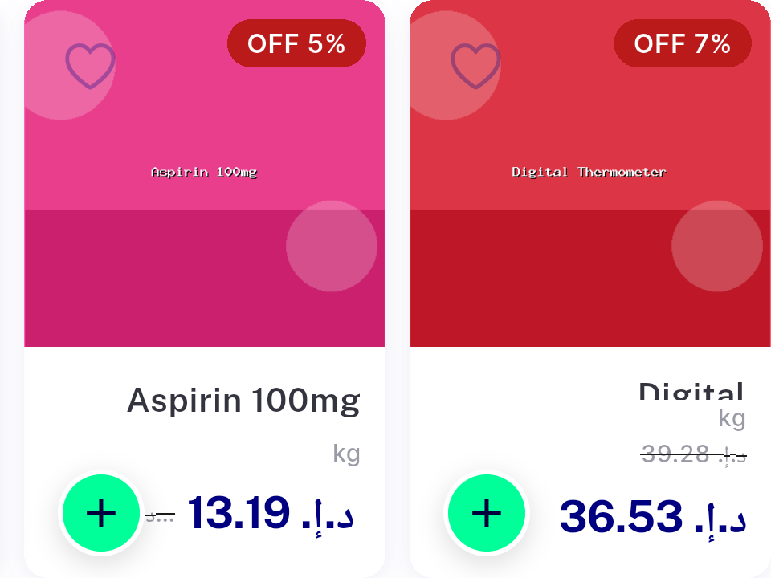</a> pass ar thermometer store43 cycle2</td>
</tr>
<tr>
<td align="center" width="33%"> pass en coldflu vitaminc bloodpressure store7 cycle2</td>
<td align="center" width="33%"><a href="pass-en-thermometer-aspirin-store43-cycle2.png">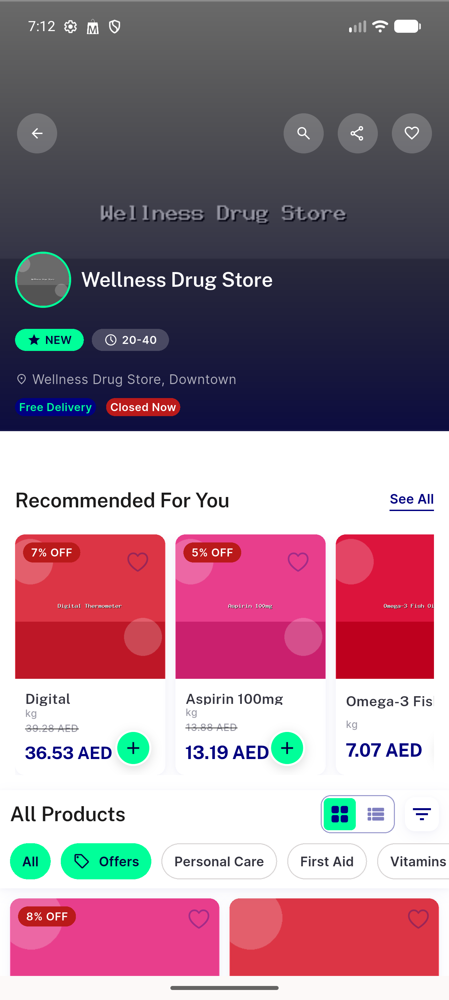</a> pass en thermometer aspirin store43 cycle2</td>
<td align="center" width="33%"> scan store43 top</td>
</tr>
<tr>
<td align="center" width="33%"><a href="scan-store7-ar-bloodpressure.png">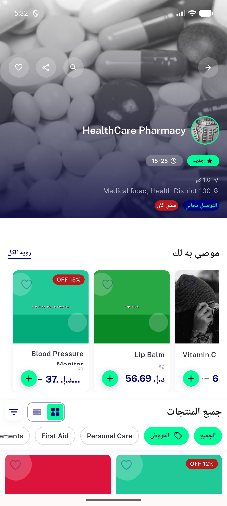</a> scan store7 ar bloodpressure</td>
<td align="center" width="33%"> scan store7 ar coldflu</td>
<td align="center" width="33%"><a href="scan-store7-ar-top.png">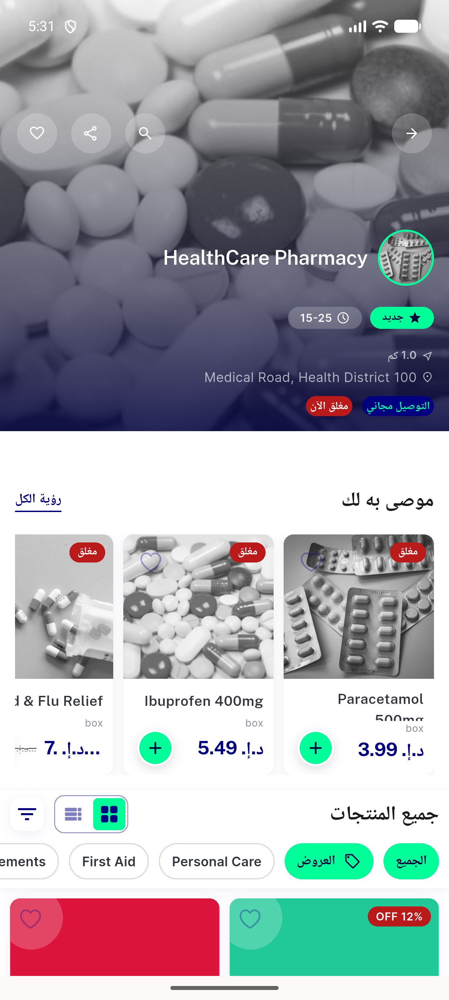</a> scan store7 ar top</td>
</tr>
<tr>
<td align="center" width="33%"><a href="scan-store7-ar-vitaminc.png">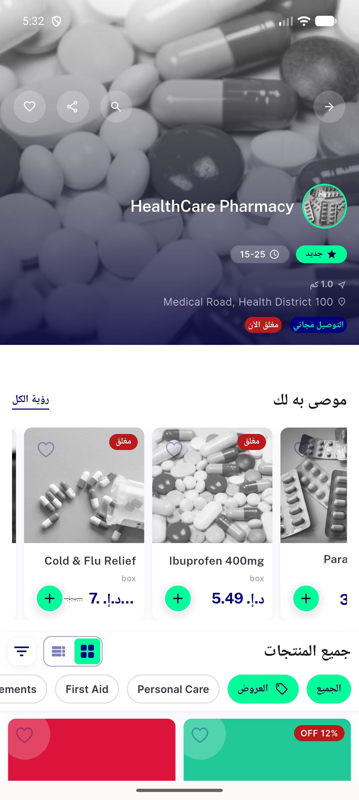</a> scan store7 ar vitaminc</td>
<td align="center" width="33%"> scan store7 coldflu</td>
<td align="center" width="33%"> scan store7 rail scrolled</td>
</tr>
<tr>
<td align="center" width="33%"> scan store7 top</td>
</tr>
</table>

### Other artifacts
- [`bug-ar-bloodpressure-truncation-dump.xml`](bug-ar-bloodpressure-truncation-dump.xml)
- [`bug-en-coldflu-truncation-dump.xml`](bug-en-coldflu-truncation-dump.xml)

---
*From `nears/docs/qa-evidence/NEARS-2626/` · public-repo scrub policy (no live secrets; verified clean).*
