# QA Evidence — NEARS-2628

**PASS -- final QA reconfirm: keyboard-Tab focus mechanism confirmed real+working live on Widgetbook Flutter-web release build; NEARS-2719 (NModuleRow active-tile ring gap) accepted/out-of-scope; 1 pre-existing NEARS-2606 test failure; pre-existing dark-mode NButton-secondary bug relayed, not re-verified per standing light-first QA policy**

**13 screenshot(s).** Click any thumbnail for full resolution.

<table>
<tr>
<td align="center" width="33%"><a href="control_native-html-focus-ring_renders-fine.png">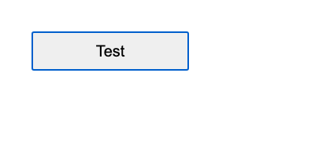</a> control native html focus ring renders fine</td>
<td align="center" width="33%"><a href="nbutton_primary_focused_crop_zoomed.png">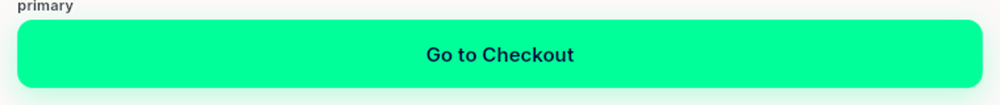</a> nbutton primary focused crop zoomed</td>
<td align="center" width="33%"><a href="nbutton_primary_focused_no-visible-ring.png">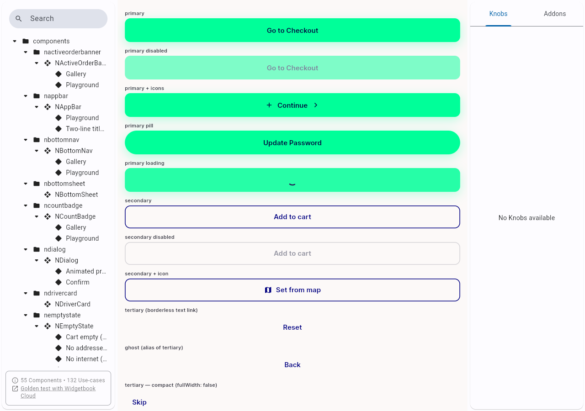</a> nbutton primary focused no visible ring</td>
</tr>
<tr>
<td align="center" width="33%"><a href="nbutton_secondary_dark-theme_PREEXISTING-invisible_unrelated.png">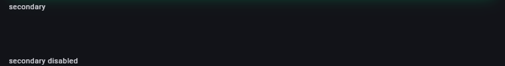</a> nbutton secondary dark theme PREEXISTING invisible unrelated</td>
<td align="center" width="33%"><a href="nbutton_secondary_focused_visible-ring-OK.png">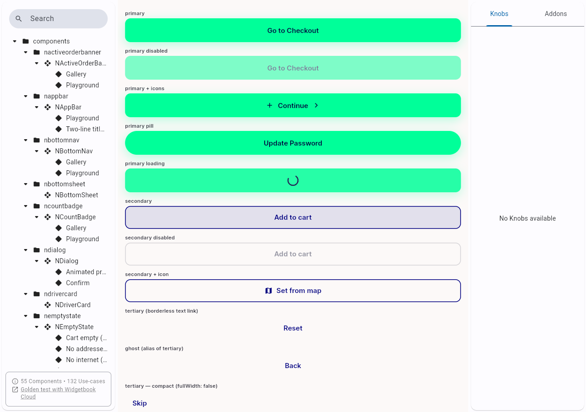</a> nbutton secondary focused visible ring OK</td>
<td align="center" width="33%"><a href="nbutton_unfocused_baseline.png">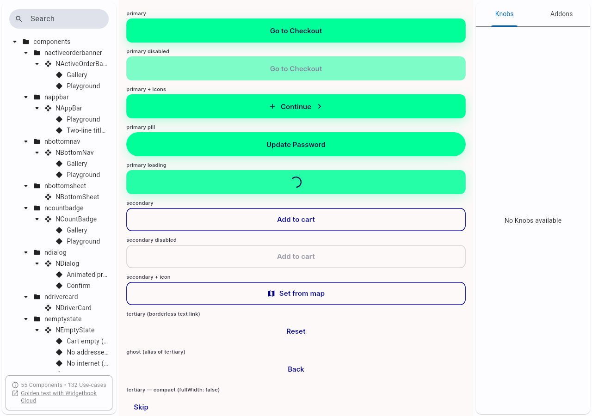</a> nbutton unfocused baseline</td>
</tr>
<tr>
<td align="center" width="33%"> nfilterchip remove btn focused crop no visible ring</td>
<td align="center" width="33%"><a href="nfilterchip_rtl_layout-ok.png">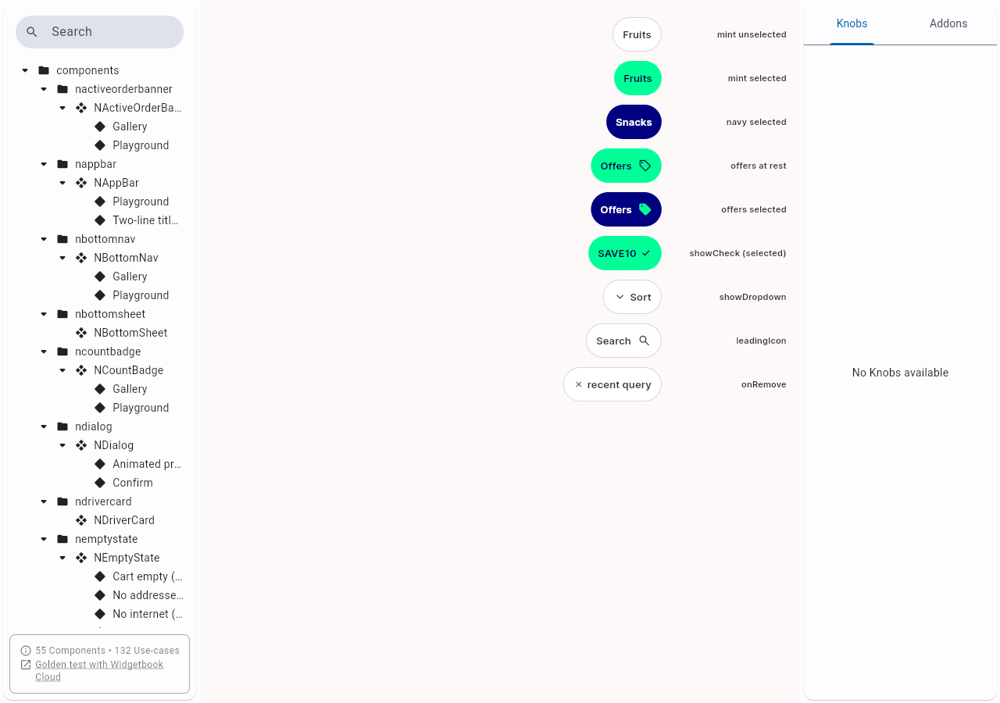</a> nfilterchip rtl layout ok</td>
<td align="center" width="33%"><a href="niconbutton_add_focused_no-visible-ring.png">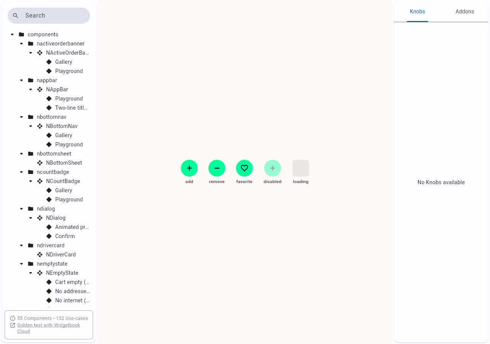</a> niconbutton add focused no visible ring</td>
</tr>
<tr>
<td align="center" width="33%"><a href="nmodulerow_food-tile_focused_no-visible-ring.png">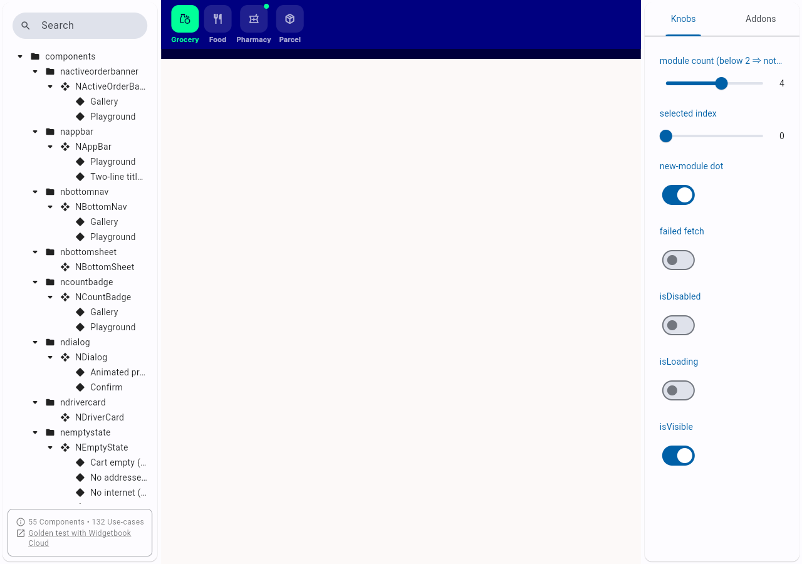</a> nmodulerow food tile focused no visible ring</td>
<td align="center" width="33%"> nmodulerow grocery tile focused no visible ring</td>
<td align="center" width="33%"><a href="ntabbar_alltabs_focused_no-visible-ring.png">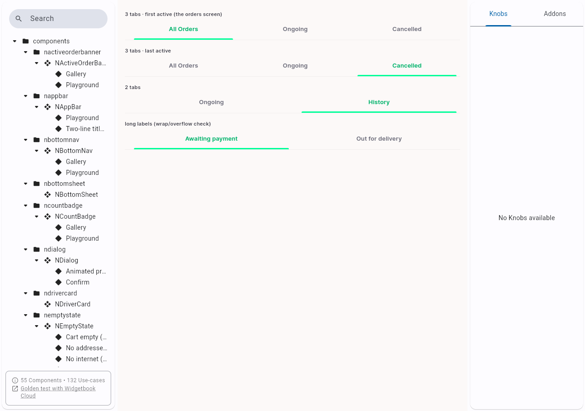</a> ntabbar alltabs focused no visible ring</td>
</tr>
<tr>
<td align="center" width="33%"><a href="ntabbar_rtl_layout-ok.png">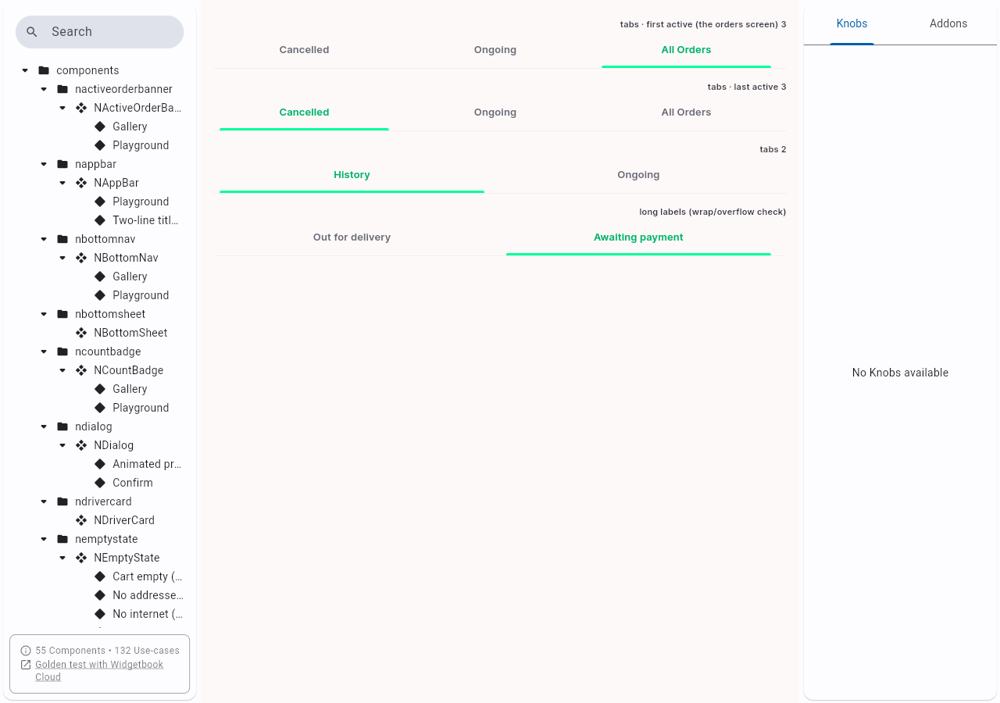</a> ntabbar rtl layout ok</td>
</tr>
</table>

### Other artifacts
- [`cycle1`](cycle1)
- [`cycle2`](cycle2)
- [`final-qa`](final-qa)

---
*From `nears/docs/qa-evidence/NEARS-2628/` · public-repo scrub policy (no live secrets; verified clean).*
