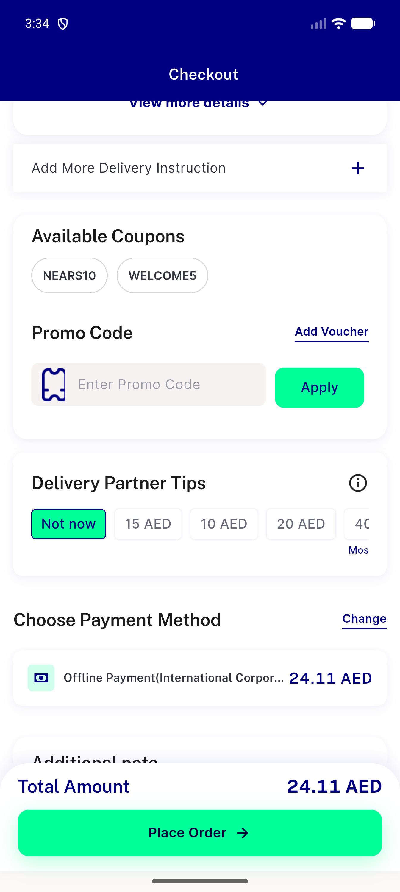
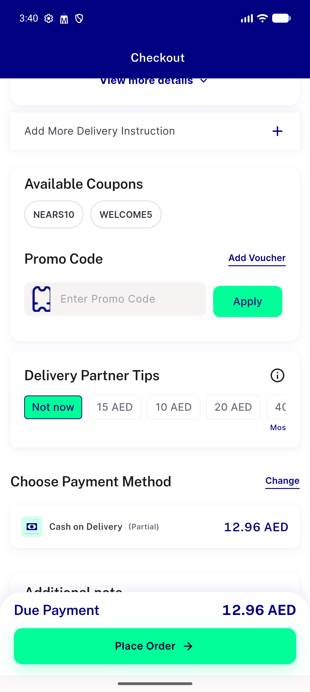
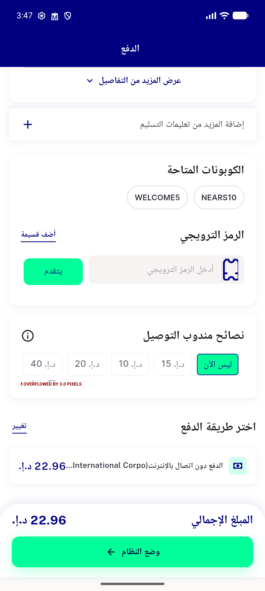
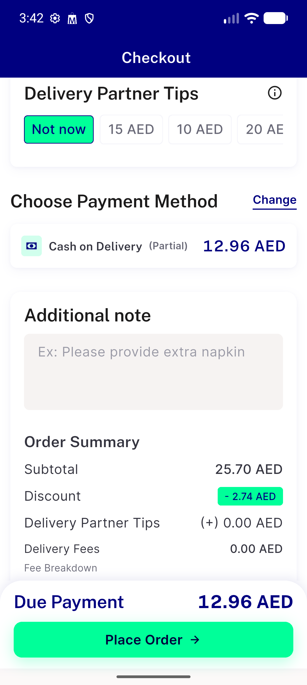
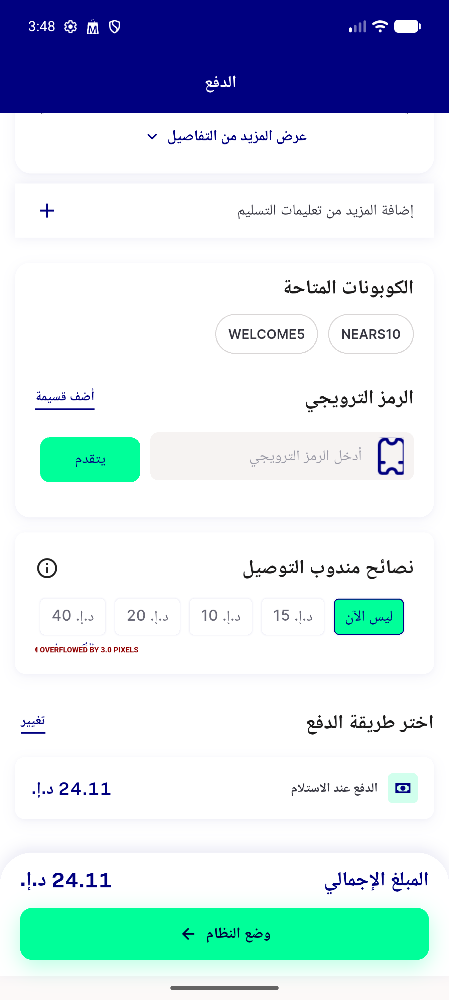

# QA Evidence — NEARS-2629

**PASS — payment-section overflow fixed, zero RenderFlex overflow across mobile/RTL/text-scale-1.3x, partial-pay badge renders as separate widget**

**5 screenshot(s).** Click any thumbnail for full resolution.

<table>
<tr>
<td align="center" width="33%"> ac1 offline payment ellipsis</td>
<td align="center" width="33%"> ac4 partial badge</td>
<td align="center" width="33%"> ac5 rtl arabic offline payment</td>
</tr>
<tr>
<td align="center" width="33%"> ac6 textscale 1.3 payment row</td>
<td align="center" width="33%"> bug multistore order placement fail</td>
</tr>
</table>

### Other artifacts
- [`bug-multistore-order-placement-fail.log`](bug-multistore-order-placement-fail.log)
- [`bug-tips-widget-overflow-textscale.log`](bug-tips-widget-overflow-textscale.log)

---
*From `nears/docs/qa-evidence/NEARS-2629/` · public-repo scrub policy (no live secrets; verified clean).*
