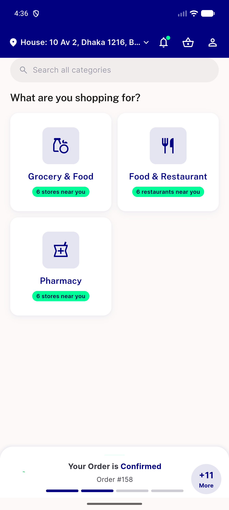

# QA Evidence — NEARS-2631

**PASS — NEARS-2631 offline-payment double-log fix verified via automated real-ApiClient transport-throw harness (established precedent pattern); live UI reach blocked by a Data DoR gap (0 active offline_payment_methods)**

**1 screenshot(s).** Click any thumbnail for full resolution.

<table>
<tr>
<td align="center" width="33%"> dashboard postnav</td>
</tr>
</table>

### Other artifacts
- [`ac-evidence.log`](ac-evidence.log)

---
*From `nears/docs/qa-evidence/NEARS-2631/` · public-repo scrub policy (no live secrets; verified clean).*
