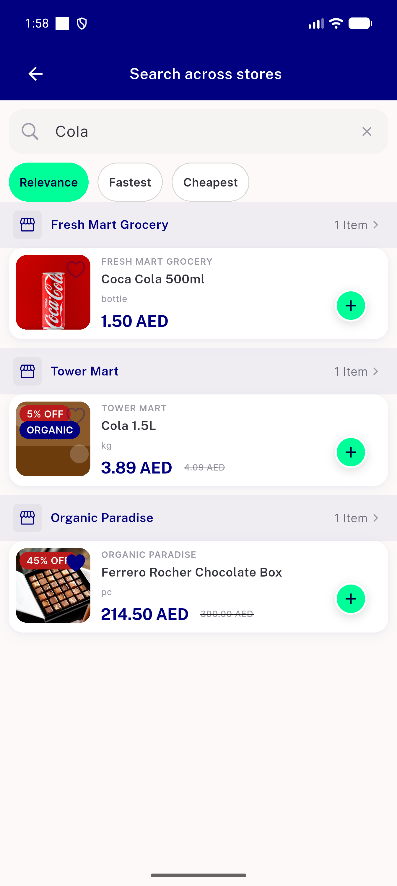
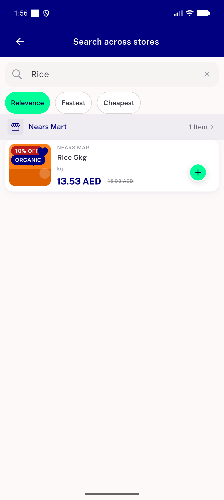
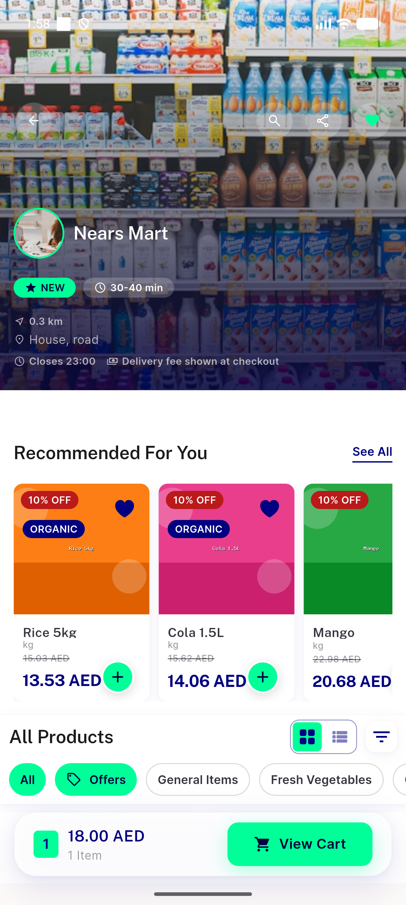
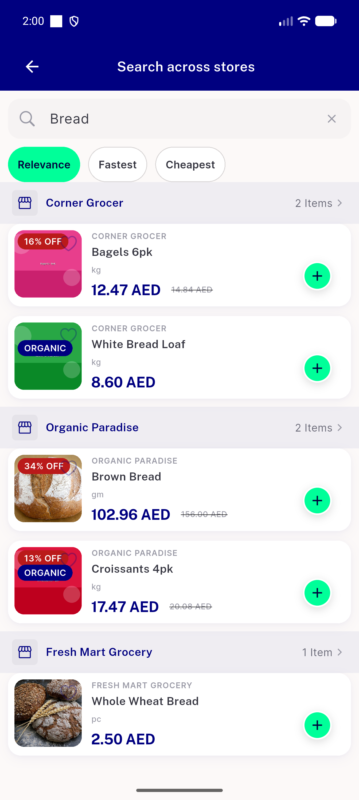
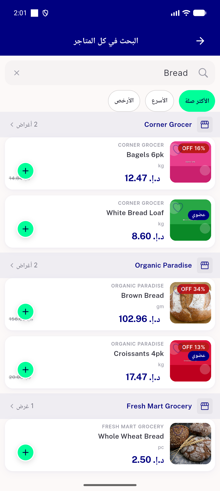
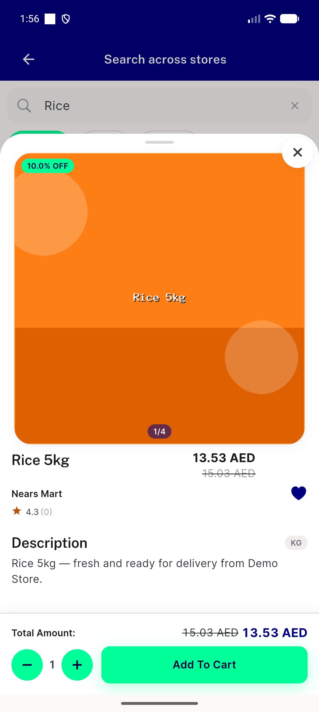

# QA Evidence — NEARS-2632

**PASS — NSectionHeader.store migration on cross-store search headers; 6/6 AC-relevant ACs live-verified light-mode, RTL confirmed, 9/9 automated backstop**

**6 screenshot(s).** Click any thumbnail for full resolution.

<table>
<tr>
<td align="center" width="33%"> ac1 multi store groups</td>
<td align="center" width="33%"> ac1 store header single store</td>
<td align="center" width="33%"> ac2 tap navigates to store</td>
</tr>
<tr>
<td align="center" width="33%"> ac6 pluralization 2items</td>
<td align="center" width="33%"> ac7 rtl store headers</td>
<td align="center" width="33%"> followup a11y bounds overlap itemsheet</td>
</tr>
</table>

---
*From `nears/docs/qa-evidence/NEARS-2632/` · public-repo scrub policy (no live secrets; verified clean).*
