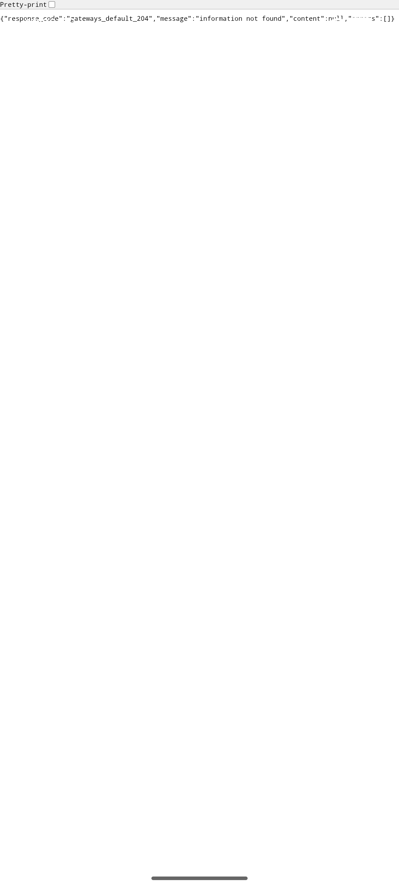
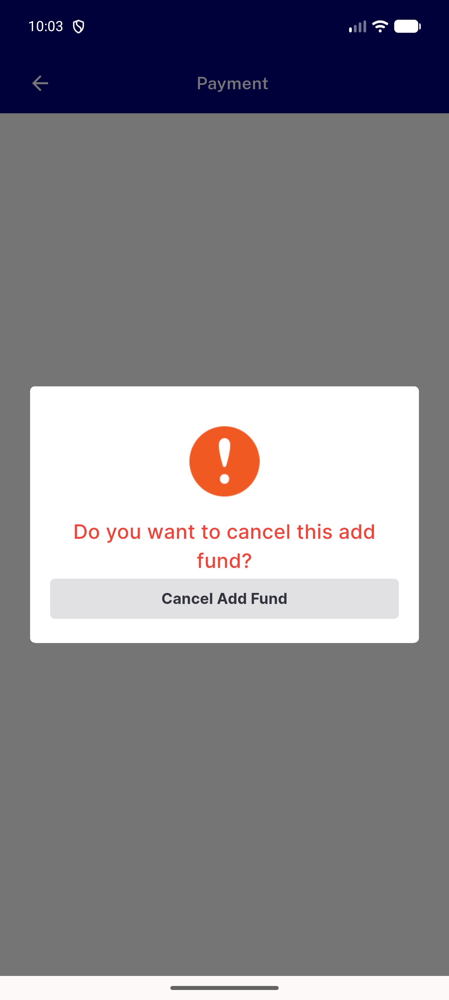
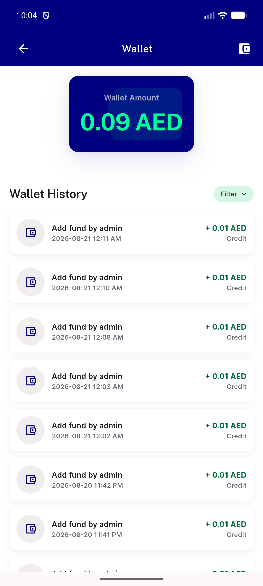
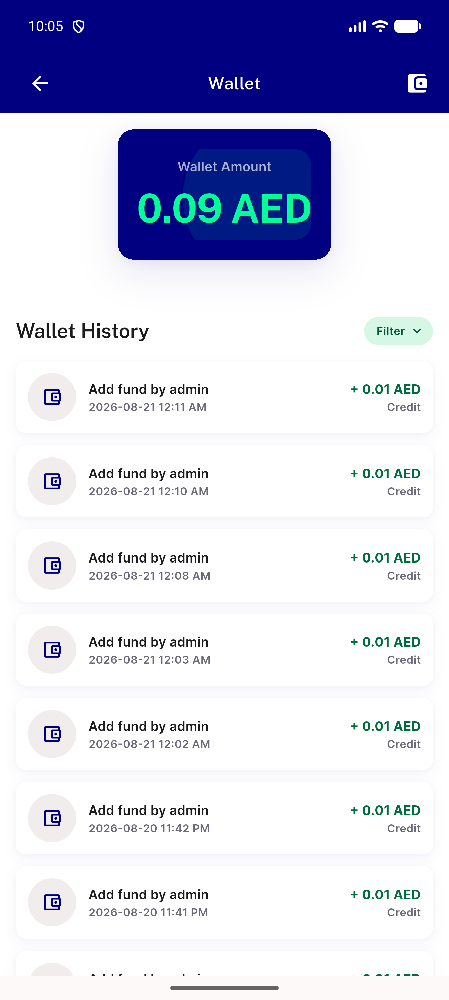
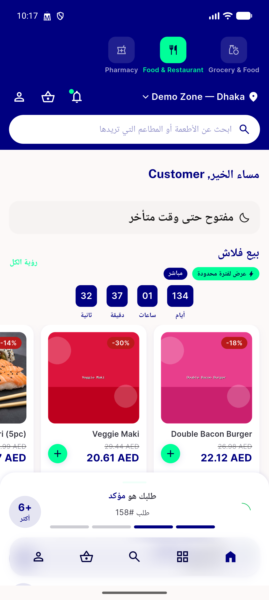
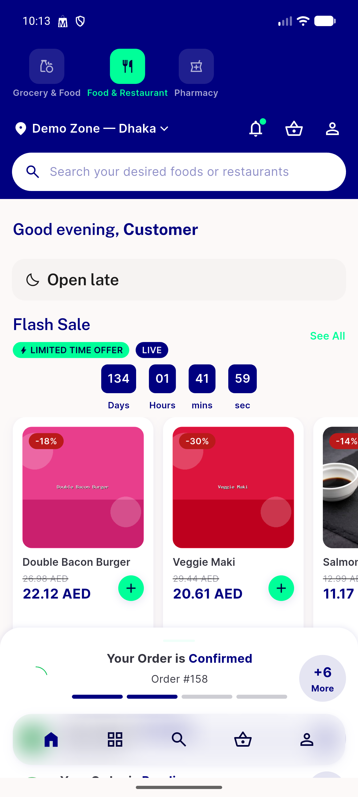

# QA Evidence — NEARS-2634

**PASS — AppBar-back-then-Cancel single-tap fix verified live, wallet + order-payment paths, RTL sanity, no regressions**

**6 screenshot(s).** Click any thumbnail for full resolution.

<table>
<tr>
<td align="center" width="33%"> inapp browser</td>
<td align="center" width="33%"> ac1 cancel add fund dialog</td>
<td align="center" width="33%"> ac2 ac3 lands on wallet</td>
</tr>
<tr>
<td align="center" width="33%"> rapid double tap single cancel lands wallet</td>
<td align="center" width="33%"> rtl sanity arabic</td>
<td align="center" width="33%"> spotcheck order payment failed dialog</td>
</tr>
</table>

### Other artifacts
- [`progress.md`](progress.md)

---
*From `nears/docs/qa-evidence/NEARS-2634/` · public-repo scrub policy (no live secrets; verified clean).*
