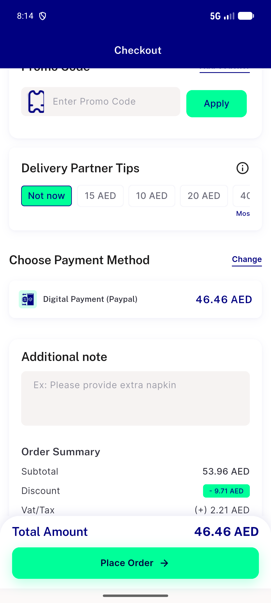
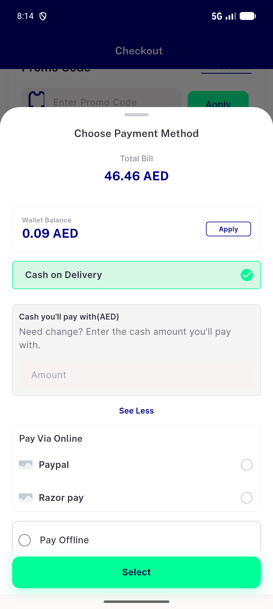
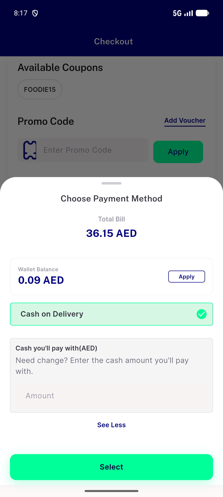
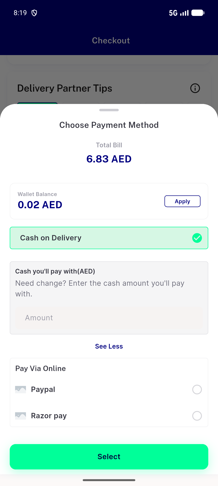

# QA Evidence — NEARS-2635

**PASS - zone1 digital_payment=1 fix verified live (Paypal/Razor pay tiles), zone2 negative control clean (COD-only), zone3 positive control unaffected**

**4 screenshot(s).** Click any thumbnail for full resolution.

<table>
<tr>
<td align="center" width="33%"> ac2 zone1 digital payment selected</td>
<td align="center" width="33%"> ac2 zone1 payment sheet</td>
<td align="center" width="33%"> negctrl zone2 cod only</td>
</tr>
<tr>
<td align="center" width="33%"> posctrl zone3 unaffected</td>
</tr>
</table>

### Other artifacts
- [`bug-checkout-distance-fallback.log`](bug-checkout-distance-fallback.log)

---
*From `nears/docs/qa-evidence/NEARS-2635/` · public-repo scrub policy (no live secrets; verified clean).*
