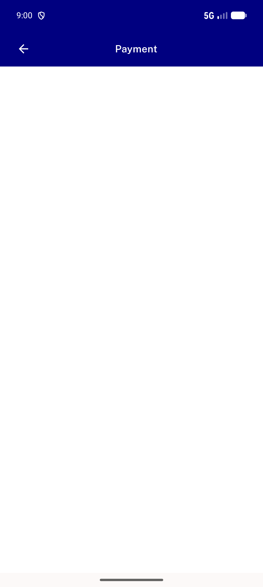
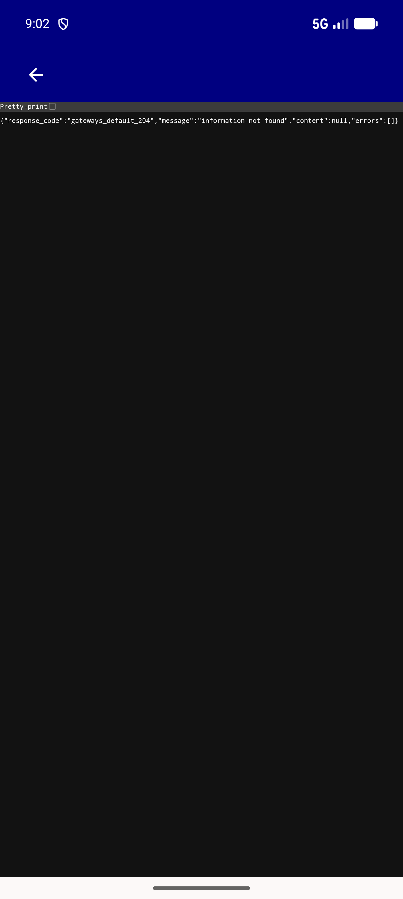
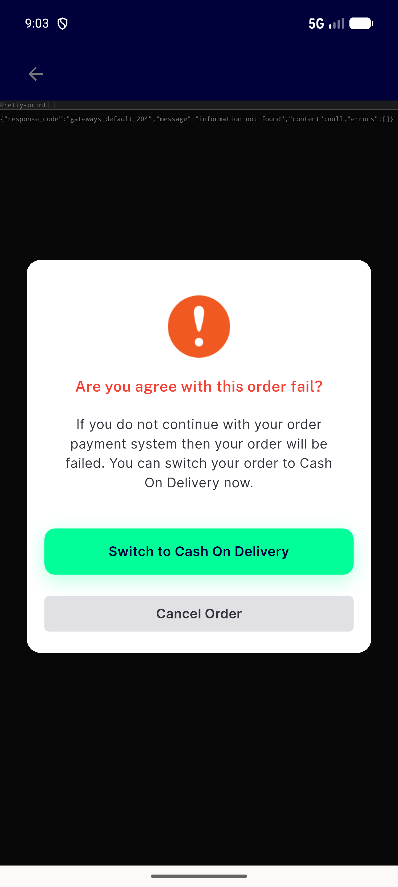

# QA Evidence — NEARS-2636

**PASS -- payInWevView override verified live: default build unchanged (PaymentScreen), --dart-define=PAY_IN_WEBVIEW=true build reaches PaymentWebViewScreen, exit-dialog confirmed live**

**3 screenshot(s).** Click any thumbnail for full resolution.

<table>
<tr>
<td align="center" width="33%"> ac1 default build paymentscreen</td>
<td align="center" width="33%"> ac2 override build paymentwebviewscreen</td>
<td align="center" width="33%"> ac3 exit dialog live</td>
</tr>
</table>

### Other artifacts
- [`progress.md`](progress.md)

---
*From `nears/docs/qa-evidence/NEARS-2636/` · public-repo scrub policy (no live secrets; verified clean).*
