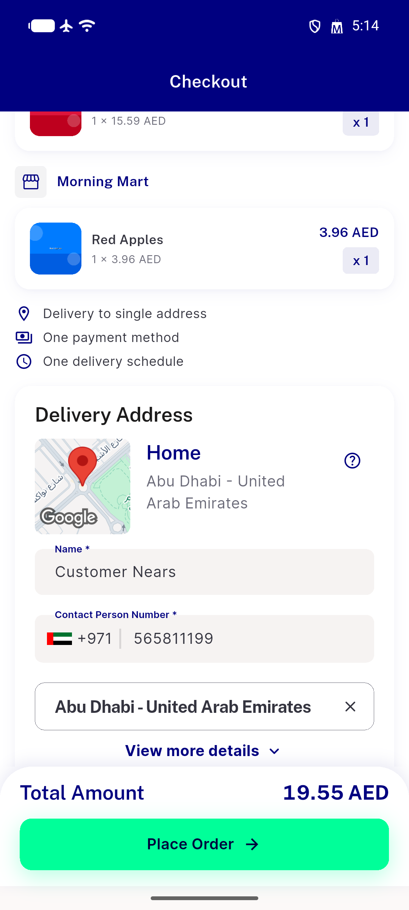
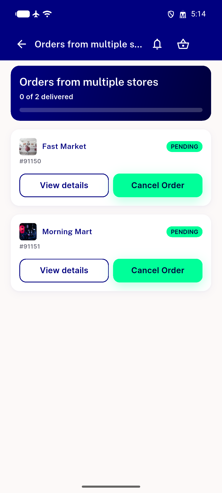
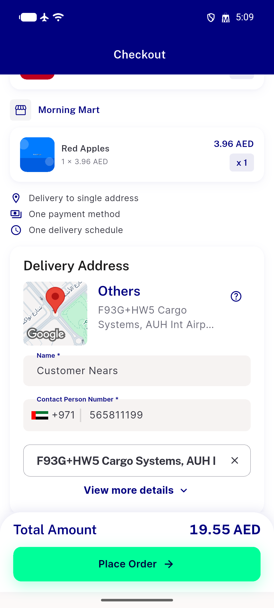
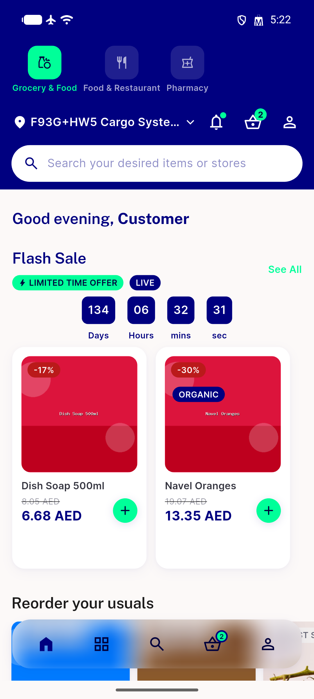
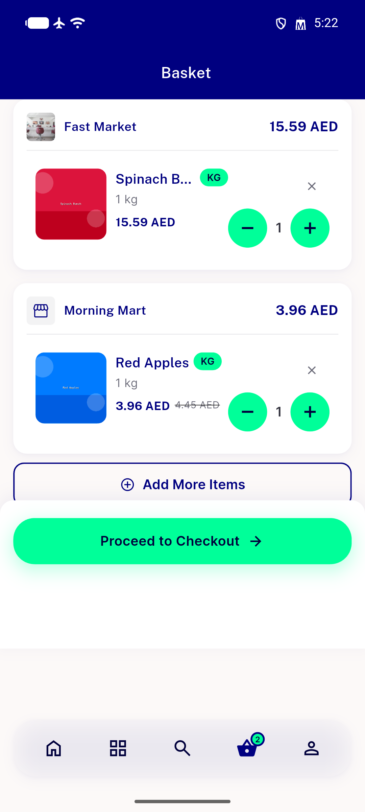
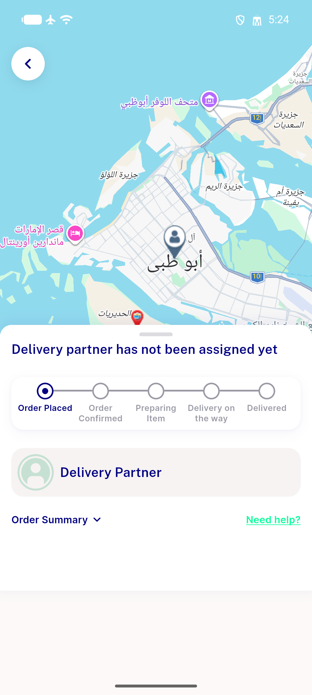

# QA Evidence — NEARS-2642

**PASS — multi-store checkout Place Order fix verified live (AC1+AC2), full regression sweep clean, 1 pre-existing unrelated regression logged (checkout edit-address dead control)**

**6 screenshot(s).** Click any thumbnail for full resolution.

<table>
<tr>
<td align="center" width="33%"> ac1 checkout with switched address</td>
<td align="center" width="33%"> ac1 multistore switched address order success</td>
<td align="center" width="33%"> bug checkout edit address unresponsive</td>
</tr>
<tr>
<td align="center" width="33%"> regression home hero render</td>
<td align="center" width="33%"> regression multistore cart render</td>
<td align="center" width="33%"> regression single store checkout success</td>
</tr>
</table>

### Other artifacts
- [`ac2-group-place-200-and-be-orders.log`](ac2-group-place-200-and-be-orders.log)
- [`bug-checkout-edit-address-unresponsive.log`](bug-checkout-edit-address-unresponsive.log)

---
*From `nears/docs/qa-evidence/NEARS-2642/` · public-repo scrub policy (no live secrets; verified clean).*
