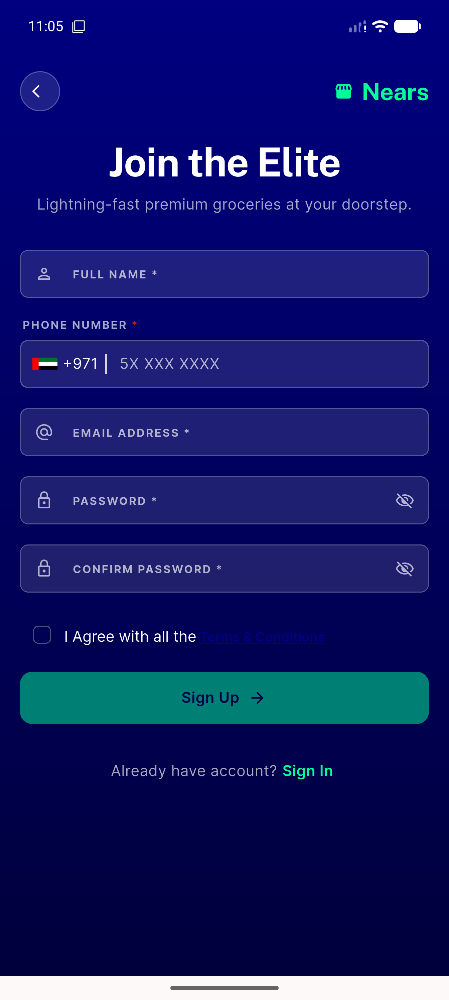
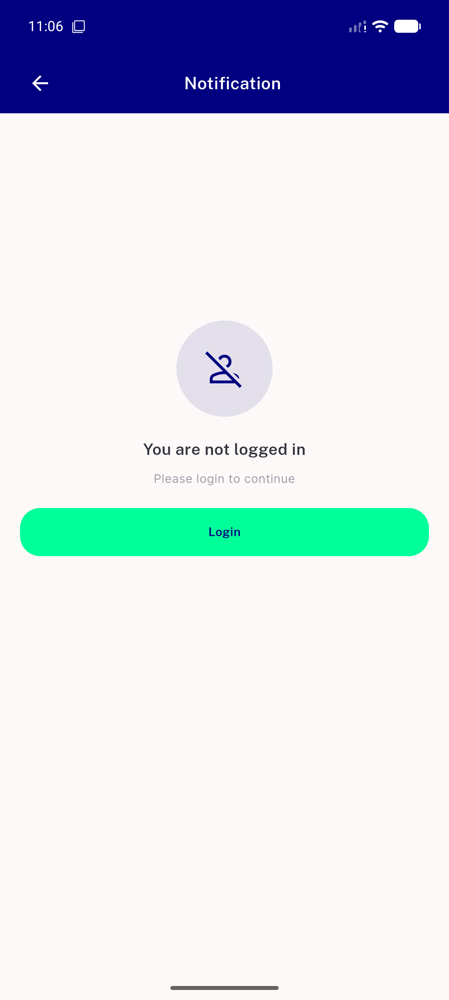
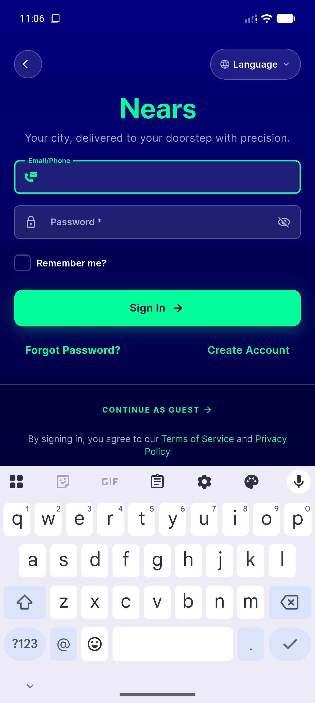

# QA Evidence — NEARS-2643

**PASS - unreachability confirmed live: 4/5 sites live-verified mobile-branch-active (no wordmark), 5th (new_user_setup_screen) code+mechanism-corroborated (OTP-gated UI path pre-existing infra limitation)**

**4 screenshot(s).** Click any thumbnail for full resolution.

<table>
<tr>
<td align="center" width="33%"> sign up screen mobile</td>
<td align="center" width="33%"> notlogged in footer view mobile</td>
<td align="center" width="33%"> notloggedin login routes to signin not dialog</td>
</tr>
<tr>
<td align="center" width="33%"> menuscreen loginsignup routes to signin not dialog</td>
</tr>
</table>

---
*From `nears/docs/qa-evidence/NEARS-2643/` · public-repo scrub policy (no live secrets; verified clean).*
