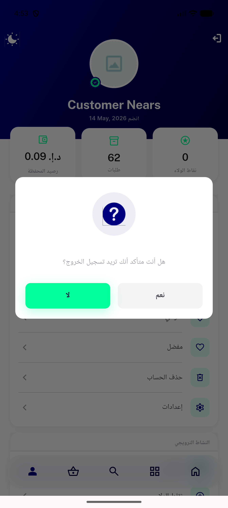

# QA Evidence — NEARS-2645

**PASS — logout tap-debounce, all 3 sites confirmed >=1<=1 invalidation POST, RTL sanity clean, 106/106 automated tests green**

**1 screenshot(s).** Click any thumbnail for full resolution.

<table>
<tr>
<td align="center" width="33%"> rtl dialog hero signout</td>
</tr>
</table>

### Other artifacts
- [`automated-backstop.txt`](automated-backstop.txt)
- [`site1-menu-general-logout-net-log.txt`](site1-menu-general-logout-net-log.txt)
- [`site2-hero-signout-net-log.txt`](site2-hero-signout-net-log.txt)
- [`site3-profilescreen-logout-net-log.txt`](site3-profilescreen-logout-net-log.txt)

---
*From `nears/docs/qa-evidence/NEARS-2645/` · public-repo scrub policy (no live secrets; verified clean).*
