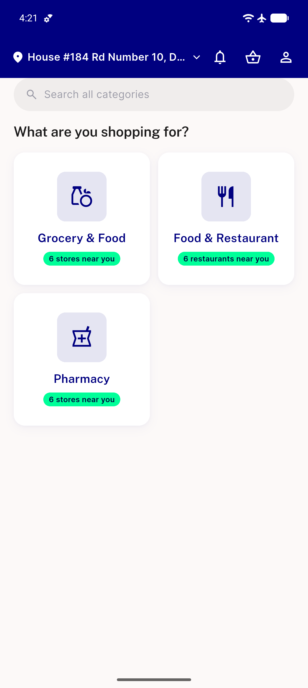

# QA Evidence — NEARS-2646

**PASS -- zero-diff investigation confirmed honest; light spot-check of Access Location/SelectAddress flow shows English throughout, no locale flip**

**1 screenshot(s).** Click any thumbnail for full resolution.

<table>
<tr>
<td align="center" width="33%"> spotcheck home english</td>
</tr>
</table>

---
*From `nears/docs/qa-evidence/NEARS-2646/` · public-repo scrub policy (no live secrets; verified clean).*
