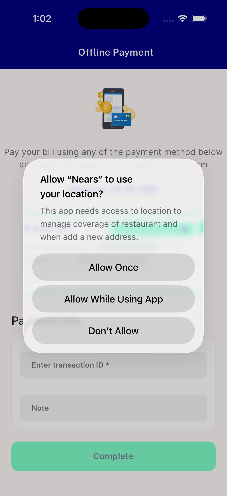
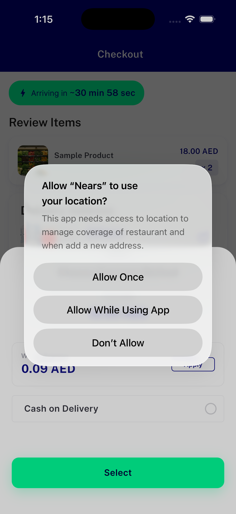

# QA Evidence — NEARS-2647

**FAIL: AC1/AC2/AC4 pass live; AC3 (checkout entry) blocked by business_settings.offline_payment_status=0 client-side AND-gate**

**2 screenshot(s).** Click any thumbnail for full resolution.

<table>
<tr>
<td align="center" width="33%"> ac4 offline payment retry entry</td>
<td align="center" width="33%"> bug ac3 checkout offline tile hidden</td>
</tr>
</table>

### Other artifacts
- [`bug-ac3-checkout-offline-tile-hidden.log`](bug-ac3-checkout-offline-tile-hidden.log)

---
*From `nears/docs/qa-evidence/NEARS-2647/` · public-repo scrub policy (no live secrets; verified clean).*
