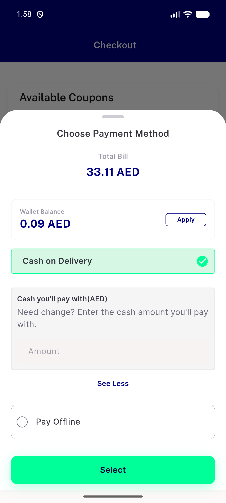
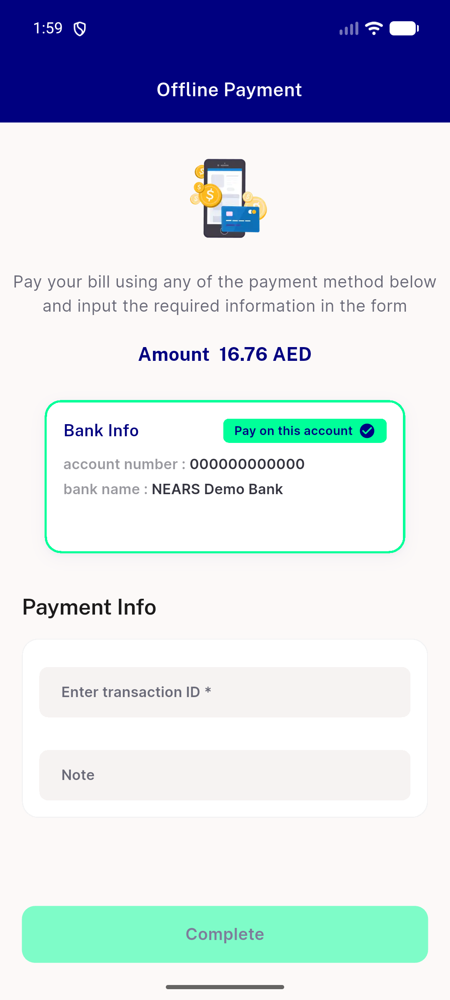
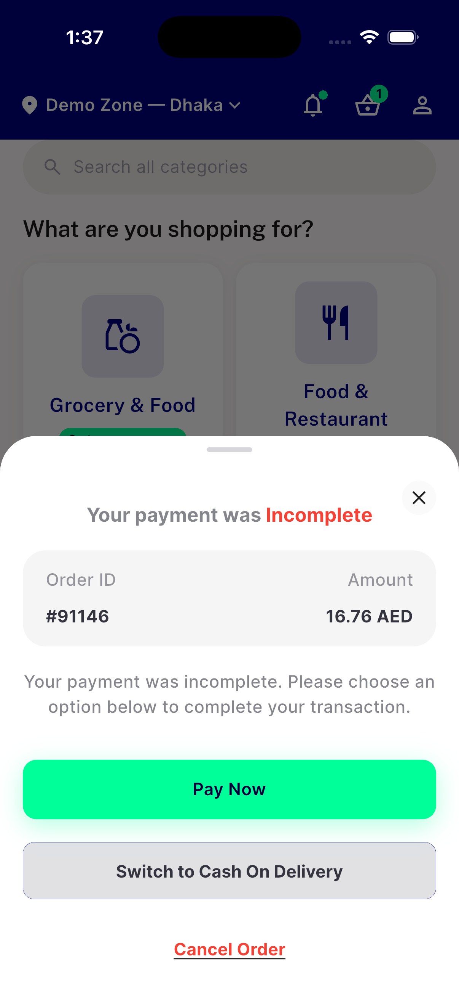

# QA Evidence — NEARS-2647

**PASS (delta cycle 1) - AC3 fixed: Pay Offline tile now renders live via checkout + payment-retry entry points**

**5 screenshot(s).** Click any thumbnail for full resolution.

<table>
<tr>
<td align="center" width="33%"> ac3 checkout pay offline cycle1</td>
<td align="center" width="33%"> ac4 offline payment retry entry</td>
<td align="center" width="33%"> ac4 payment retry offline screen cycle1</td>
</tr>
<tr>
<td align="center" width="33%"> bug ac3 checkout offline tile hidden</td>
<td align="center" width="33%"> dbg1</td>
</tr>
</table>

### Other artifacts
- [`bug-ac3-checkout-offline-tile-hidden.log`](bug-ac3-checkout-offline-tile-hidden.log)

---
*From `nears/docs/qa-evidence/NEARS-2647/` · public-repo scrub policy (no live secrets; verified clean).*
