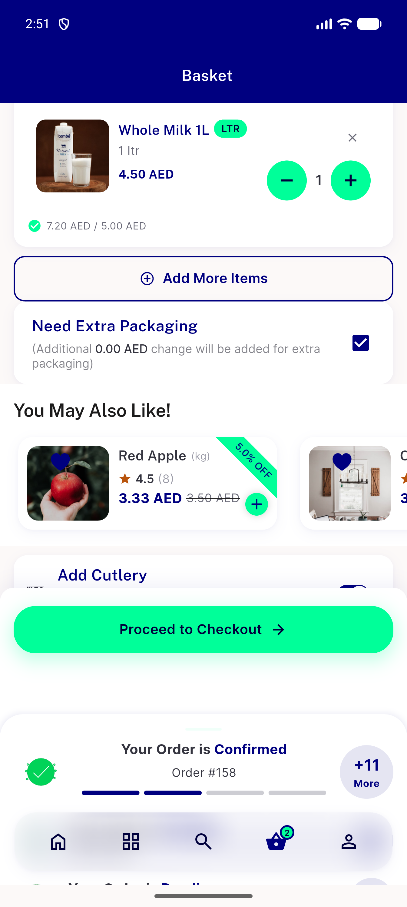

# QA Evidence — NEARS-2649

**PASS — cutlery/extra-packaging mobile gate fix confirmed live on Fresh Mart Grocery (store id=2)**

**1 screenshot(s).** Click any thumbnail for full resolution.

<table>
<tr>
<td align="center" width="33%"> ac1 ac2 cutlery packaging fresh mart grocery</td>
</tr>
</table>

### Other artifacts
- [`ac3-a11y-dump-fresh-mart-grocery.xml`](ac3-a11y-dump-fresh-mart-grocery.xml)
- [`regression-no-cutlery-store3-organic-paradise-dump.xml`](regression-no-cutlery-store3-organic-paradise-dump.xml)

---
*From `nears/docs/qa-evidence/NEARS-2649/` · public-repo scrub policy (no live secrets; verified clean).*
