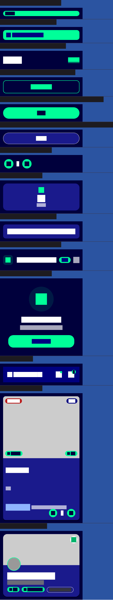
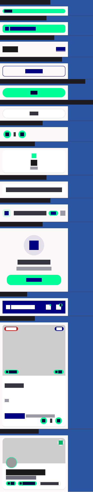

# QA Evidence — NEARS-2655

**PASS - DLS gallery golden rebaseline verified, root cause NEARS-2598 NIconButton tapMin confirmed, tests green**

**4 screenshot(s).** Click any thumbnail for full resolution.

<table>
<tr>
<td align="center" width="33%"> ac3 gallery dark post rebaseline</td>
<td align="center" width="33%"> ac3 gallery light post rebaseline</td>
<td align="center" width="33%"> bug itemcard stepper reflow after</td>
</tr>
<tr>
<td align="center" width="33%"> bug itemcard stepper reflow before</td>
</tr>
</table>

---
*From `nears/docs/qa-evidence/NEARS-2655/` · public-repo scrub policy (no live secrets; verified clean).*
