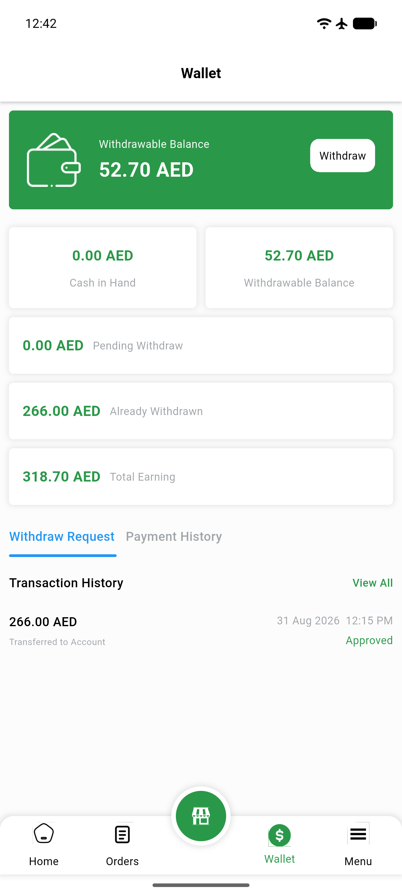

# QA Evidence — NEARS-2658

**BLOCKED — code fix verified static+automated; live E2E of AC1-3 blocked by Data DoR gap (no seeded vendor has adjust_able=true)**

**1 screenshot(s).** Click any thumbnail for full resolution.

<table>
<tr>
<td align="center" width="33%"> wallet screen baseline</td>
</tr>
</table>

---
*From `nears/docs/qa-evidence/NEARS-2658/` · public-repo scrub policy (no live secrets; verified clean).*
