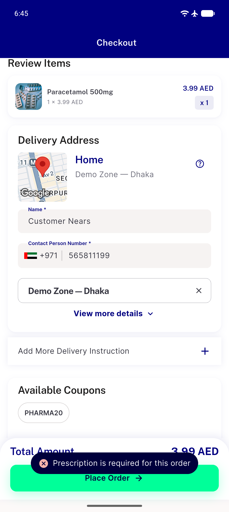
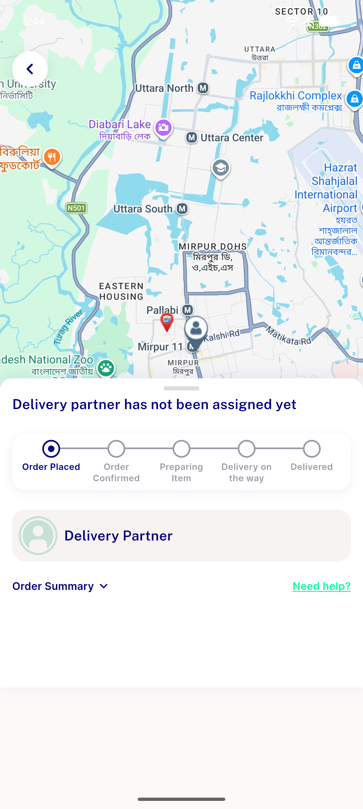

# QA Evidence — NEARS-2659

**PASS -- device emulator-5558, prescription picker render-gate fix verified live**

**3 screenshot(s).** Click any thumbnail for full resolution.

<table>
<tr>
<td align="center" width="33%"> ac1 picker general checkout</td>
<td align="center" width="33%"> ac4 prescription order placed</td>
<td align="center" width="33%"> regression rtl prescription checkout</td>
</tr>
</table>

### Other artifacts
- [`ac1-semantics-tree-picker-visible.txt`](ac1-semantics-tree-picker-visible.txt)
- [`ac2-semantics-tree-no-picker.txt`](ac2-semantics-tree-no-picker.txt)

---
*From `nears/docs/qa-evidence/NEARS-2659/` · public-repo scrub policy (no live secrets; verified clean).*
