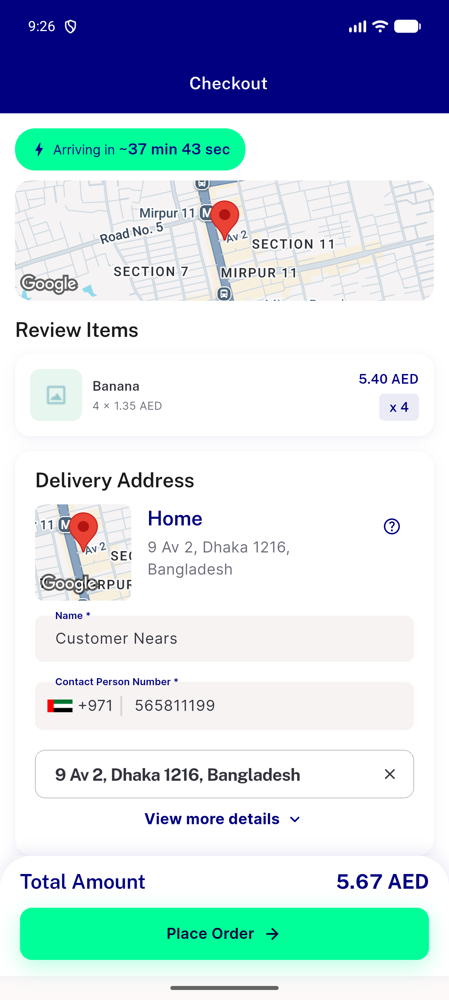
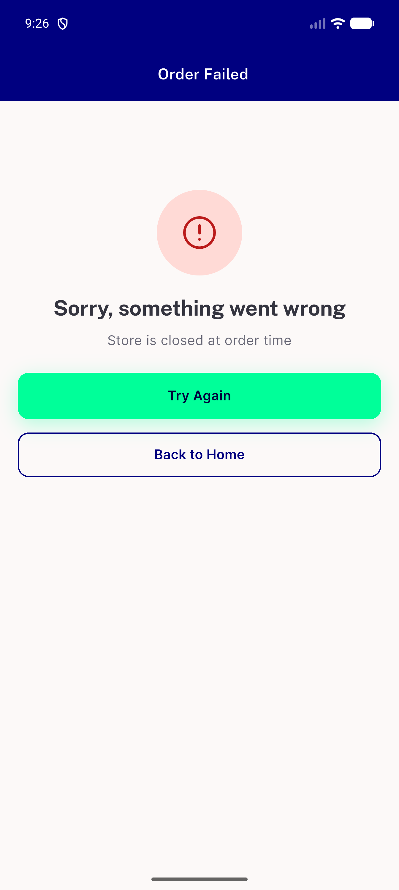

# QA Evidence — NEARS-2660

**PASS — get-Tax 403 false-positive fixed for Rx cart; prescription gate still enforced at real placement (code-verified); logs-first clean; automated backstop 26/26**

**2 screenshot(s).** Click any thumbnail for full resolution.

<table>
<tr>
<td align="center" width="33%"> ac1 checkout plain cart 200</td>
<td align="center" width="33%"> order failed store closed</td>
</tr>
</table>

### Other artifacts
- [`ac2-rx-cart-get-tax-200.log`](ac2-rx-cart-get-tax-200.log)
- [`ac3-positive-control-invalid-coupon-403.log`](ac3-positive-control-invalid-coupon-403.log)
- [`bug-otel-export-failure-noise.log`](bug-otel-export-failure-noise.log)

---
*From `nears/docs/qa-evidence/NEARS-2660/` · public-repo scrub policy (no live secrets; verified clean).*
