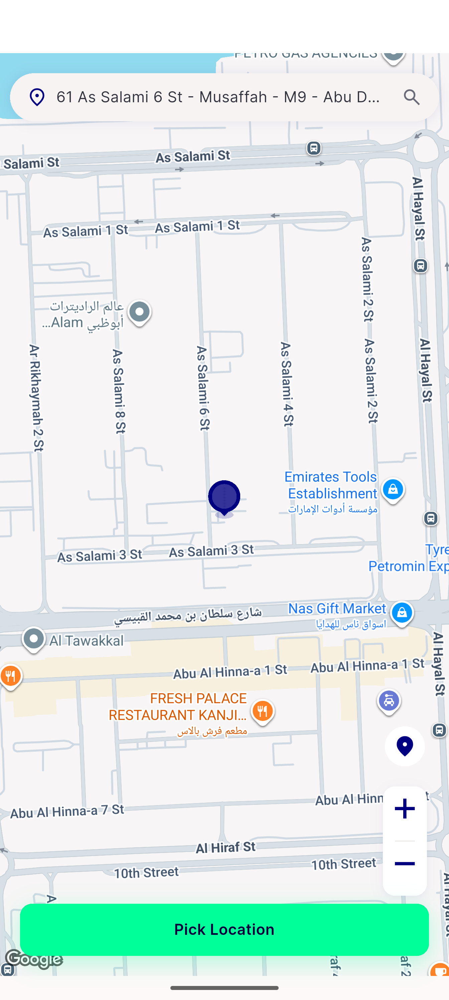

# QA Evidence — NEARS-2663

**PASS — NLocationSelector tapMin 44dp confirmed live (device + a11y bounds), tap-precision at both edges opens picker, goldens unchanged**

**4 screenshot(s).** Click any thumbnail for full resolution.

<table>
<tr>
<td align="center" width="33%"> ac2 bottom edge tap opens picker</td>
<td align="center" width="33%"> ac2 top edge tap opens picker</td>
<td align="center" width="33%"> home location row</td>
</tr>
<tr>
<td align="center" width="33%"> home rtl location row</td>
</tr>
</table>

### Other artifacts
- [`home-a11y-dump.xml`](home-a11y-dump.xml)
- [`home-rtl-a11y-dump.xml`](home-rtl-a11y-dump.xml)

---
*From `nears/docs/qa-evidence/NEARS-2663/` · public-repo scrub policy (no live secrets; verified clean).*
