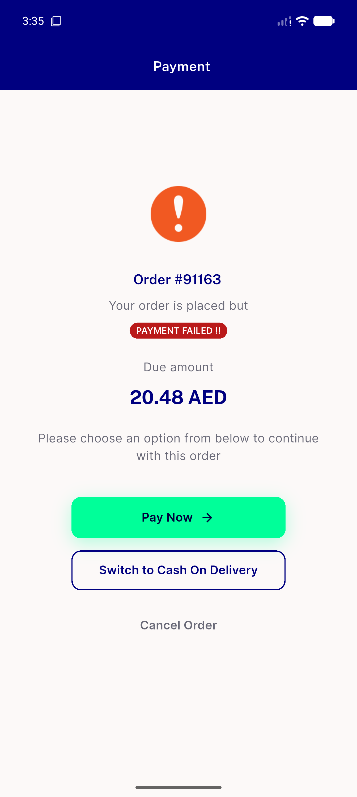

# QA Evidence — NEARS-2664

**PASS — DigitalPaymentFailedScreen dead-branch removal, live regression confirmed on emulator-5556 (UserApp)**

**1 screenshot(s).** Click any thumbnail for full resolution.

<table>
<tr>
<td align="center" width="33%"> digital payment failed screen</td>
</tr>
</table>

### Other artifacts
- [`dpfs-accessibility-dump.xml`](dpfs-accessibility-dump.xml)

---
*From `nears/docs/qa-evidence/NEARS-2664/` · public-repo scrub policy (no live secrets; verified clean).*
