# QA Evidence — NEARS-2665

**PASS - AR/RTL discount strike-through legible at 3 named items (Cold & Flu Relief, Vitamin C 1000mg, Aspirin 100mg) post fix-cycle-1 margin correction; EN/LTR regression clean**

**13 screenshot(s).** Click any thumbnail for full resolution.

<table>
<tr>
<td align="center" width="33%"><a href="ac1-ar-coldflu-rail-centered.png">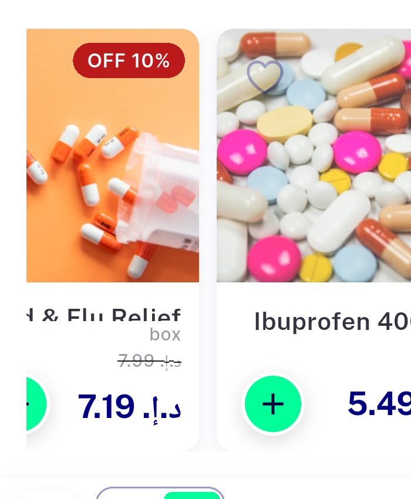</a> ac1 ar coldflu rail centered</td>
<td align="center" width="33%"><a href="ac1-ar-coldflu-rail-swiped.png">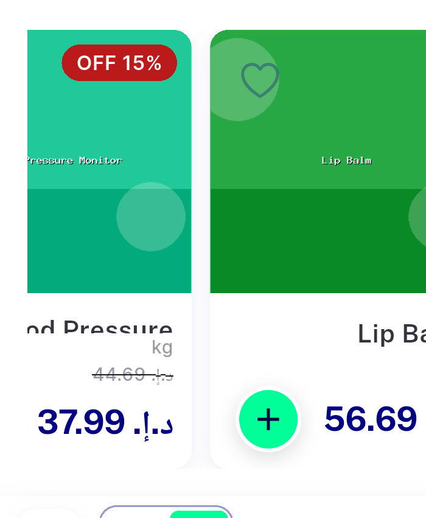</a> ac1 ar coldflu rail swiped</td>
<td align="center" width="33%"> ac1 ar coldflu rail wide</td>
</tr>
<tr>
<td align="center" width="33%"><a href="ac1-ar-coldflu-rail-wide2.png">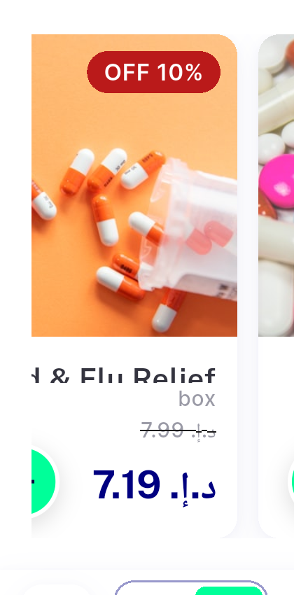</a> ac1 ar coldflu rail wide2</td>
<td align="center" width="33%"> ac1 ar coldflu rail zoom</td>
<td align="center" width="33%"><a href="ac1-ar-healthcare-grid.png">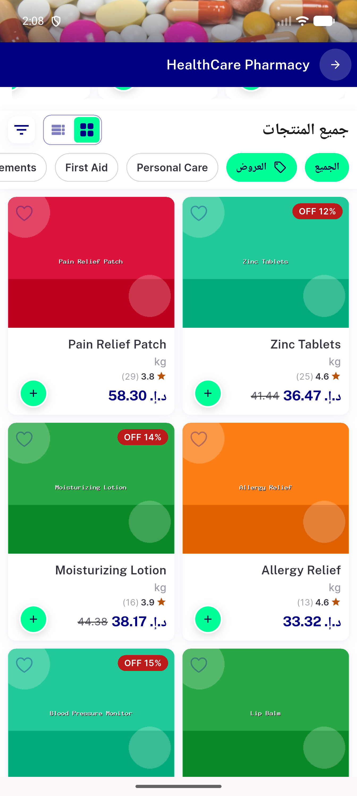</a> ac1 ar healthcare grid</td>
</tr>
<tr>
<td align="center" width="33%"><a href="ac1-ar-healthcare-top.png">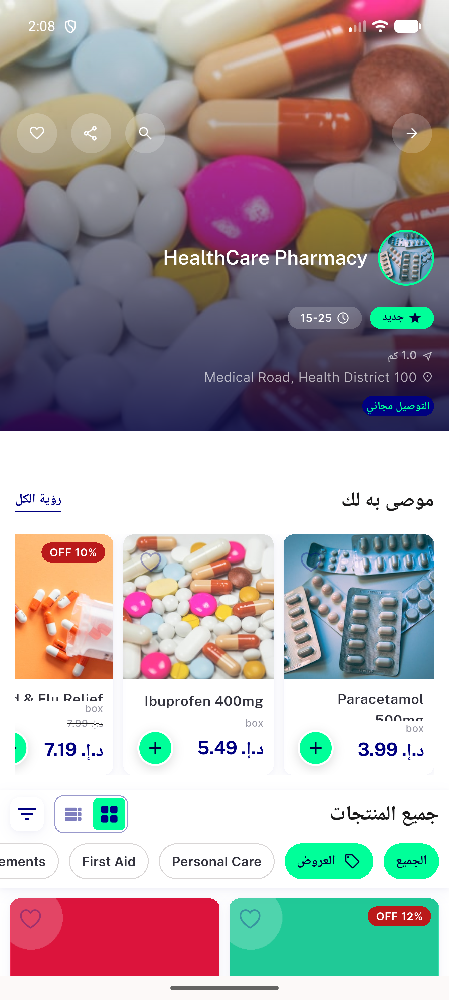</a> ac1 ar healthcare top</td>
<td align="center" width="33%"><a href="ac1-ar-healthcare-vitaminc-grid.png">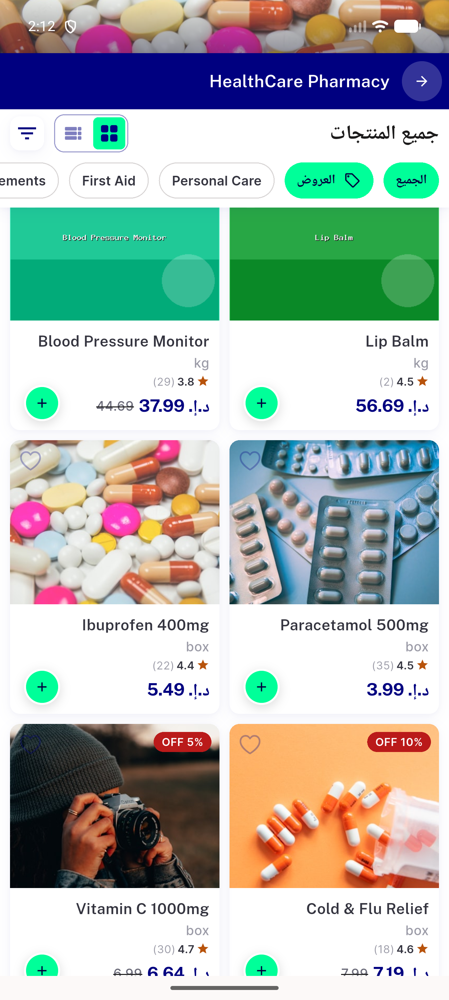</a> ac1 ar healthcare vitaminc grid</td>
<td align="center" width="33%"><a href="ac1-ar-vitaminc-coldflu-grid-full.png">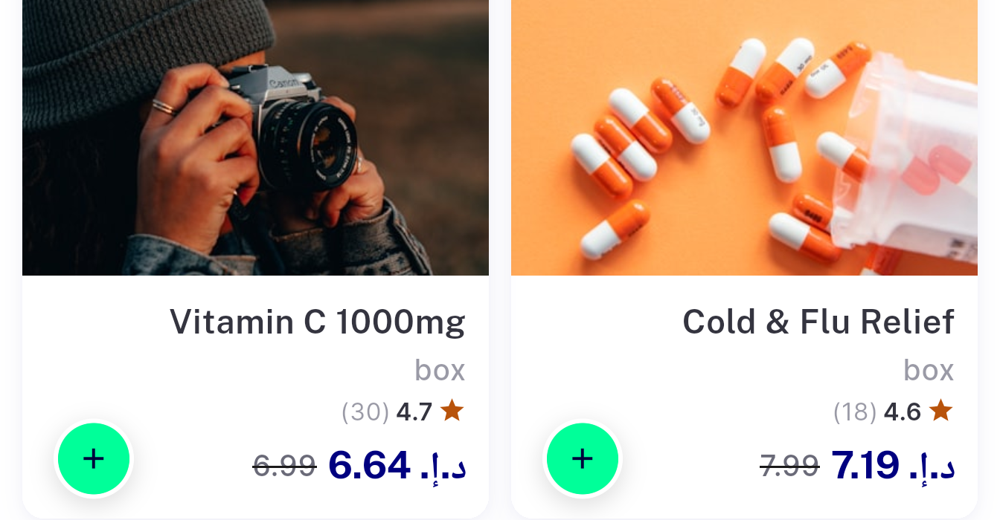</a> ac1 ar vitaminc coldflu grid full</td>
</tr>
<tr>
<td align="center" width="33%"><a href="ac1-ar-wellness-top.png">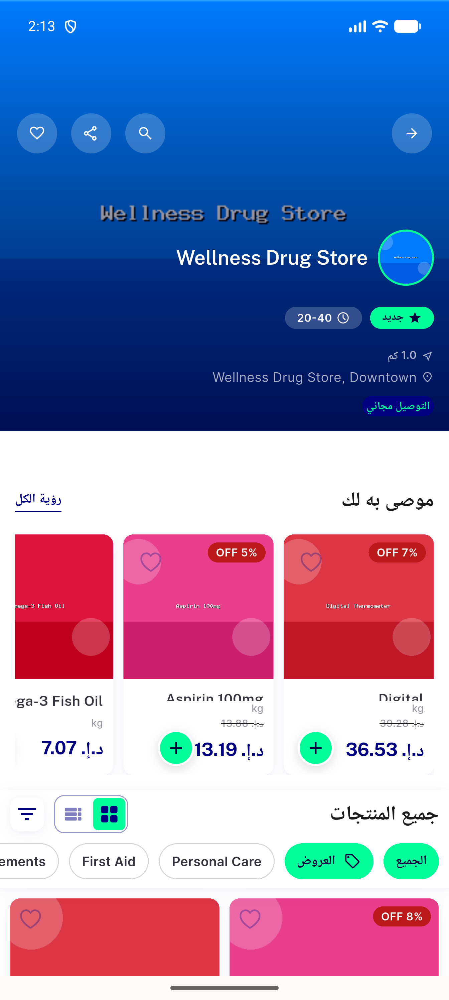</a> ac1 ar wellness top</td>
<td align="center" width="33%"><a href="ac2-en-healthcare-grid.png">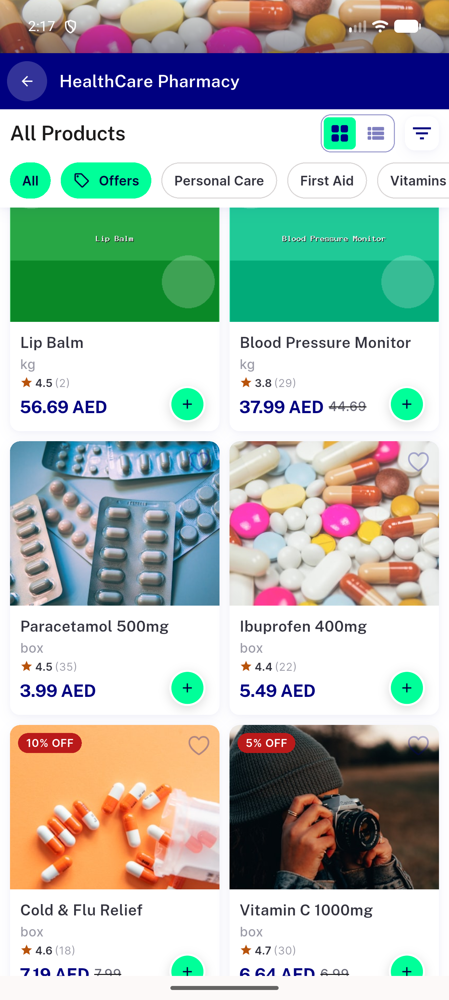</a> ac2 en healthcare grid</td>
<td align="center" width="33%"><a href="ac2-en-healthcare-top.png">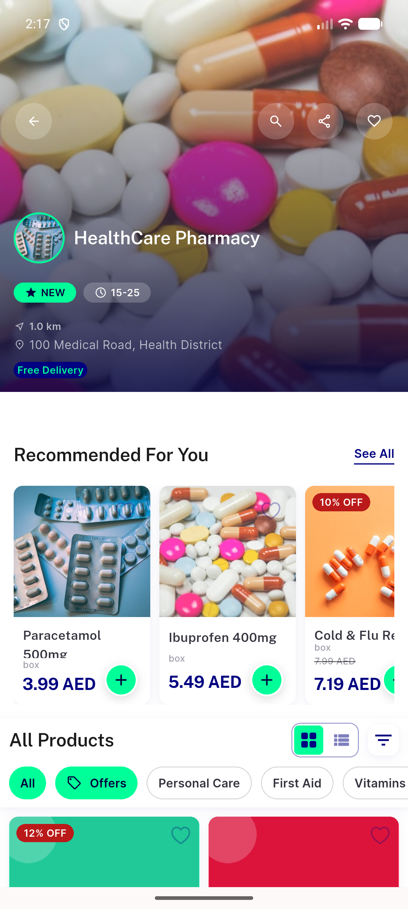</a> ac2 en healthcare top</td>
</tr>
<tr>
<td align="center" width="33%"><a href="ac2-en-wellness-top.png">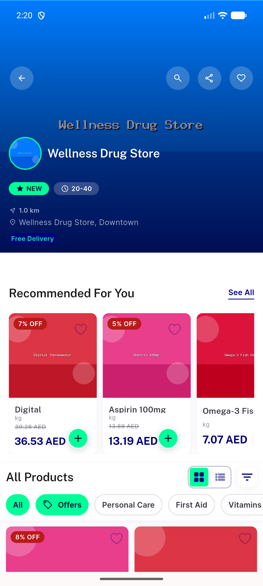</a> ac2 en wellness top</td>
</tr>
</table>

---
*From `nears/docs/qa-evidence/NEARS-2665/` · public-repo scrub policy (no live secrets; verified clean).*
