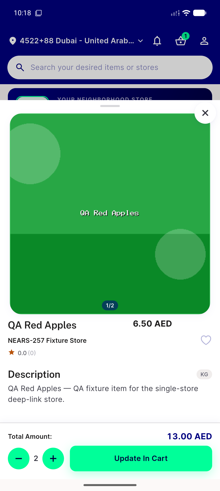

# QA Evidence — NEARS-2666

**PASS - device emulator-5556, UserApp NEARS-2666 build 0b225e8e8, item-details bottom sheet renders + close/favourite/cart controls all work post-deletion**

**1 screenshot(s).** Click any thumbnail for full resolution.

<table>
<tr>
<td align="center" width="33%"> ac3 item details sheet</td>
</tr>
</table>

---
*From `nears/docs/qa-evidence/NEARS-2666/` · public-repo scrub policy (no live secrets; verified clean).*
