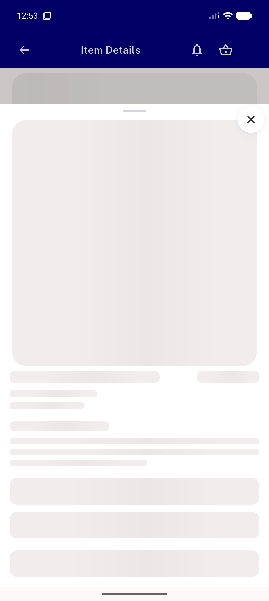
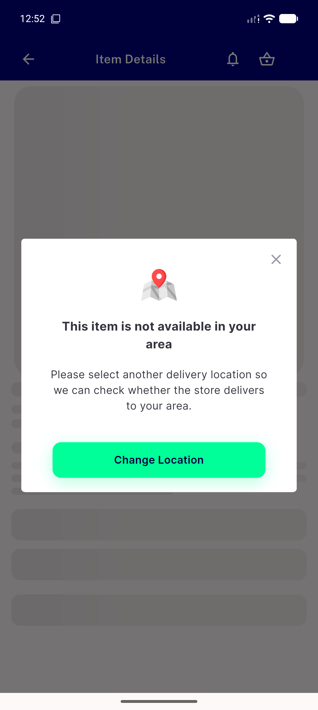
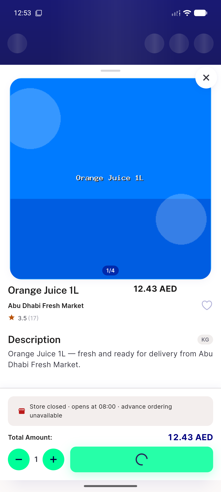

# QA Evidence — NEARS-2667

**PASS — item deep-link flash/back-stack fix verified live on emulator-5556 (warm-state), all 4 ACs demonstrated; 1 pre-existing cold-start regression logged separately**

**3 screenshot(s).** Click any thumbnail for full resolution.

<table>
<tr>
<td align="center" width="33%"> ac1 item not found</td>
<td align="center" width="33%"> ac2 zonewarning dialog</td>
<td align="center" width="33%"> ac3 success item details</td>
</tr>
</table>

### Other artifacts
- [`bug-cold-start-itemdetails-spurious-403.log`](bug-cold-start-itemdetails-spurious-403.log)

---
*From `nears/docs/qa-evidence/NEARS-2667/` · public-repo scrub policy (no live secrets; verified clean).*
