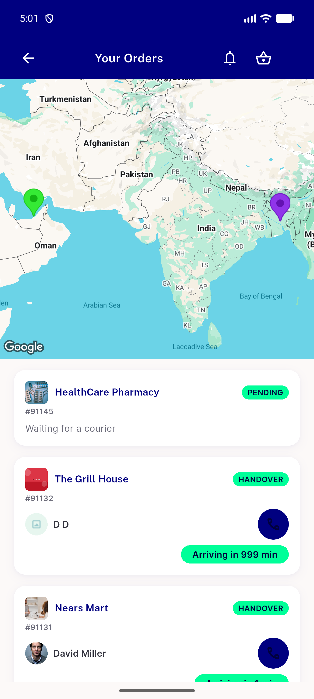
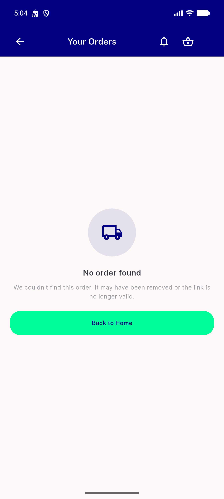
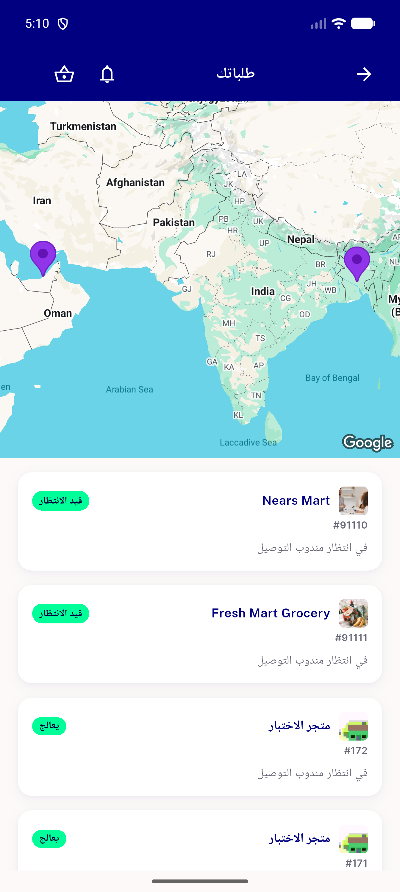
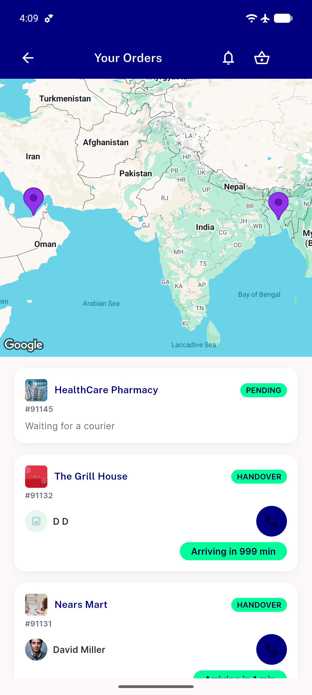

# QA Evidence — NEARS-2670

**PASS - re-QA of AC2/AC5/AC7, 9/9 ACs met**

**5 screenshot(s).** Click any thumbnail for full resolution.

<table>
<tr>
<td align="center" width="33%"> ac2 marker color correlation</td>
<td align="center" width="33%"> ac5 nemptystate</td>
<td align="center" width="33%"> ac7 hub rtl arabic</td>
</tr>
<tr>
<td align="center" width="33%"> dashboard plus11 affordance</td>
<td align="center" width="33%"> hub handover orders eta diff</td>
</tr>
</table>

### Other artifacts
- [`ac2-log-excerpt.txt`](ac2-log-excerpt.txt)
- [`ac7-log-excerpt.txt`](ac7-log-excerpt.txt)
- [`hub-a11y-dump-handover-state.xml`](hub-a11y-dump-handover-state.xml)
- [`log-excerpts.txt`](log-excerpts.txt)

---
*From `nears/docs/qa-evidence/NEARS-2670/` · public-repo scrub policy (no live secrets; verified clean).*
