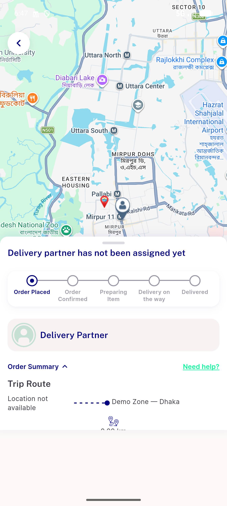

# QA Evidence — NEARS-2671

**PASS — connectivity error/retry, decode-failure/404-not-found unchanged, happy path regression clean**

**2 screenshot(s).** Click any thumbnail for full resolution.

<table>
<tr>
<td align="center" width="33%"> ac1 connectivity errorretry</td>
<td align="center" width="33%"> happy path tracking</td>
</tr>
</table>

---
*From `nears/docs/qa-evidence/NEARS-2671/` · public-repo scrub policy (no live secrets; verified clean).*
