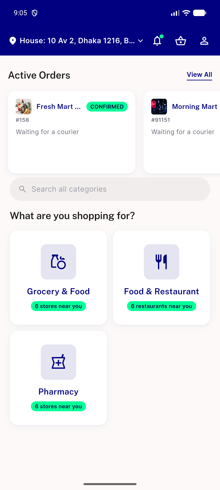
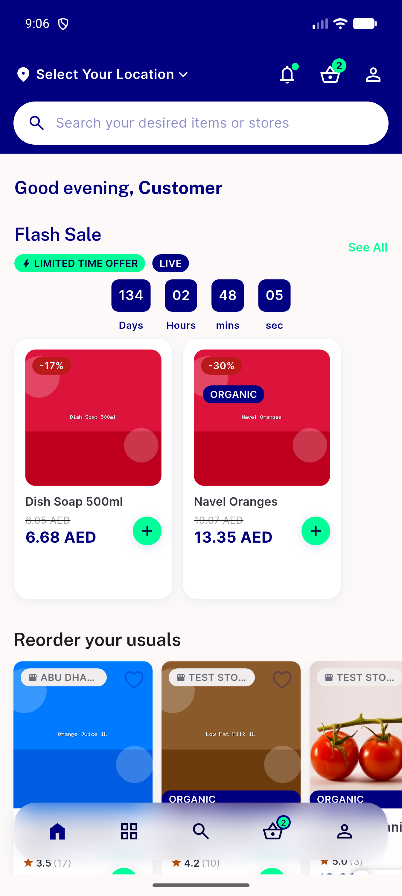

# QA Evidence — NEARS-2672

**Re-QA delta: FAIL — TB1 STILL REPRODUCES on normal-login path (4/4), passes on cold-restart (3/3). Root-cause lead: get-zone-id 404 precedes every failure. Watchdog degrades permanent-stuck to bounded 8s self-hide (real improvement, not a full fix).**

**5 screenshot(s).** Click any thumbnail for full resolution.

<table>
<tr>
<td align="center" width="33%"> ac1 sophie home</td>
<td align="center" width="33%"> bug stuck skeleton home</td>
<td align="center" width="33%"> regression track transient noorder</td>
</tr>
<tr>
<td align="center" width="33%"> reqa customer7 coldrestart pass</td>
<td align="center" width="33%"> reqa tb1 customer7 normallogin fail</td>
</tr>
</table>

### Other artifacts
- [`bug-stuck-skeleton-home-dump.xml`](bug-stuck-skeleton-home-dump.xml)
- [`bug-stuck-skeleton-nolog.log`](bug-stuck-skeleton-nolog.log)
- [`bug-transient-noorder-91124.log`](bug-transient-noorder-91124.log)
- [`reqa-customer7-coldrestart-pass.log`](reqa-customer7-coldrestart-pass.log)
- [`reqa-tb1-customer7-normallogin-fail.log`](reqa-tb1-customer7-normallogin-fail.log)

---
*From `nears/docs/qa-evidence/NEARS-2672/` · public-repo scrub policy (no live secrets; verified clean).*
