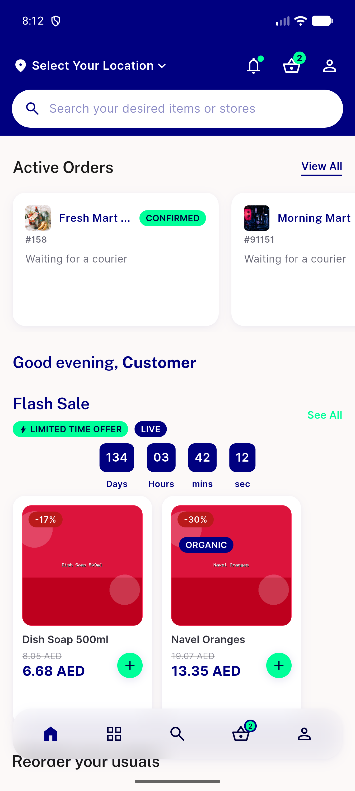
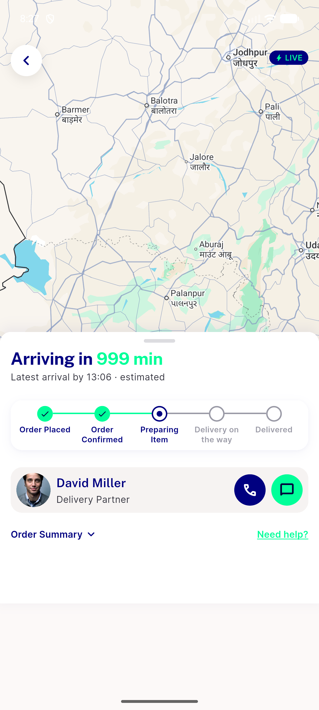

# QA Evidence — NEARS-2672

**FAIL — Home rail stuck-skeleton (auto-prefetch never fires); rail correct once populated**

**3 screenshot(s).** Click any thumbnail for full resolution.

<table>
<tr>
<td align="center" width="33%"> ac1 sophie home</td>
<td align="center" width="33%"> bug stuck skeleton home</td>
<td align="center" width="33%"> regression track transient noorder</td>
</tr>
</table>

### Other artifacts
- [`bug-stuck-skeleton-home-dump.xml`](bug-stuck-skeleton-home-dump.xml)
- [`bug-stuck-skeleton-nolog.log`](bug-stuck-skeleton-nolog.log)
- [`bug-transient-noorder-91124.log`](bug-transient-noorder-91124.log)

---
*From `nears/docs/qa-evidence/NEARS-2672/` · public-repo scrub policy (no live secrets; verified clean).*
