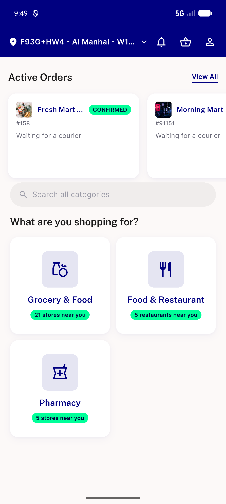
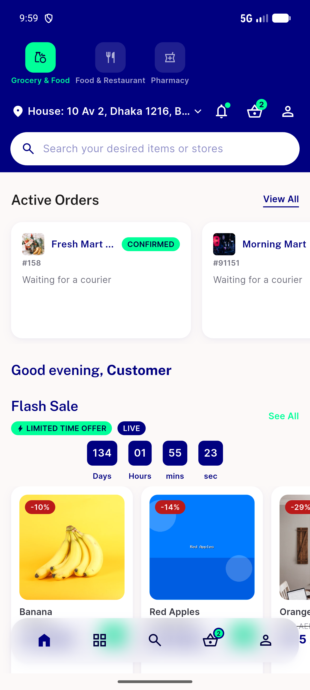

# QA Evidence — NEARS-2672

**PASS -- cycle 3 re-QA: normal-login prefetch fix verified live, rail appears immediately, no regressions**

**2 screenshot(s).** Click any thumbnail for full resolution.

<table>
<tr>
<td align="center" width="33%"> ac1 normal login rail appears</td>
<td align="center" width="33%"> regression home rail and bottomnav</td>
</tr>
</table>

---
*From `nears/docs/qa-evidence/NEARS-2672/` · public-repo scrub policy (no live secrets; verified clean).*
