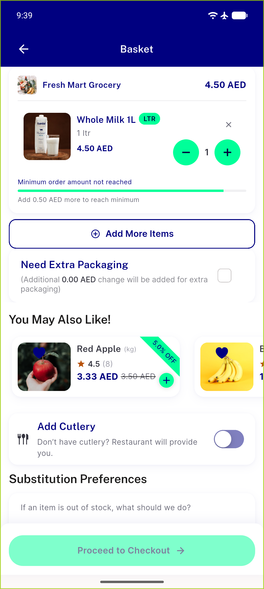
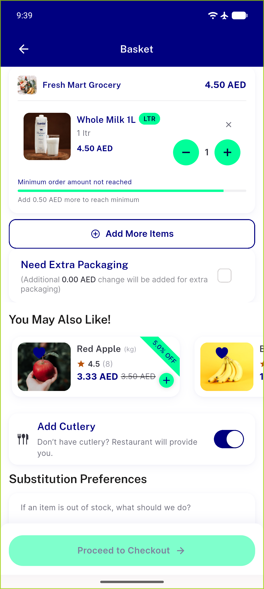

# QA Evidence — NEARS-2674

**PASS — cutlery switch + extra-packaging checkbox tap targets >=44x44, live-verified mobile + pin test (3/3)**

**3 screenshot(s).** Click any thumbnail for full resolution.

<table>
<tr>
<td align="center" width="33%"> ac1 ac2 mobile cart unchecked</td>
<td align="center" width="33%"> ac1 ac3 cutlery toggled on</td>
<td align="center" width="33%"> ac2 ac4 checkbox checked</td>
</tr>
</table>

---
*From `nears/docs/qa-evidence/NEARS-2674/` · public-repo scrub policy (no live secrets; verified clean).*
