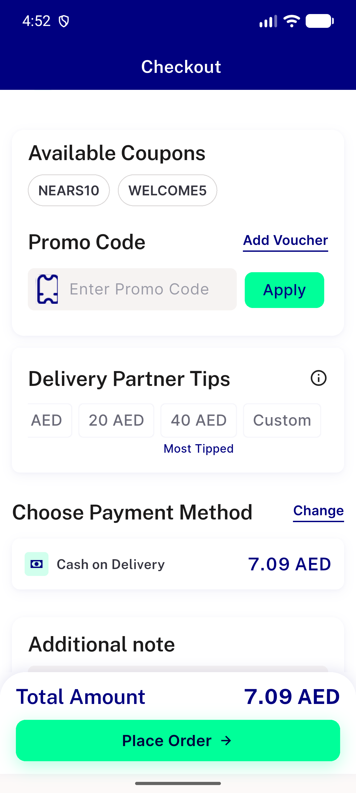
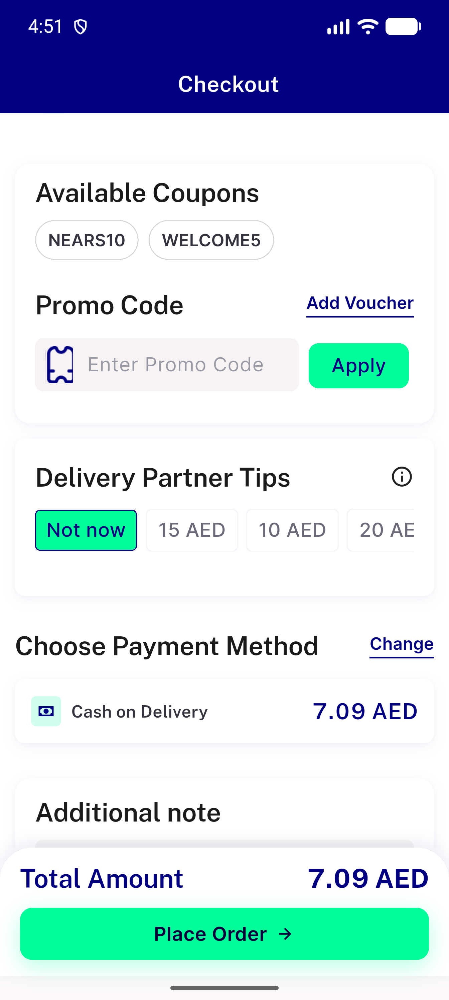
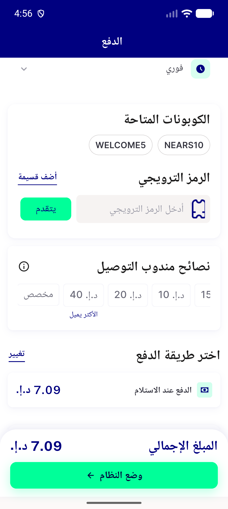
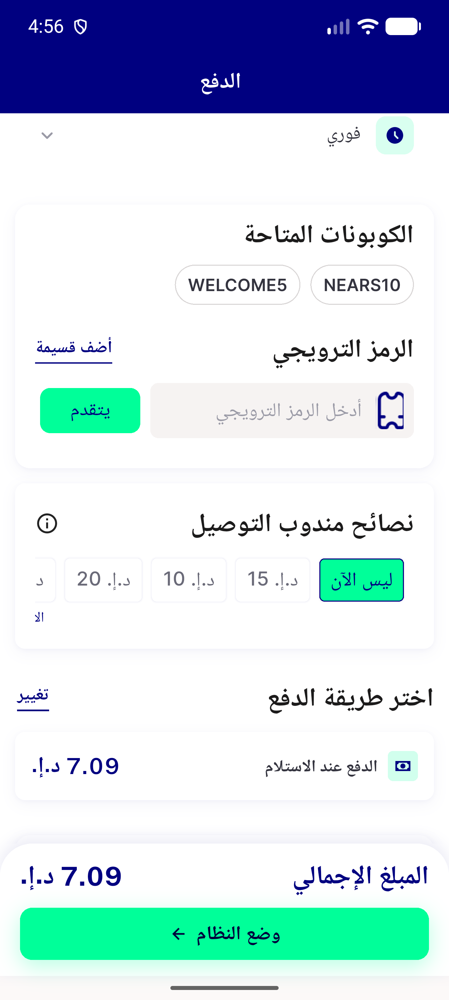
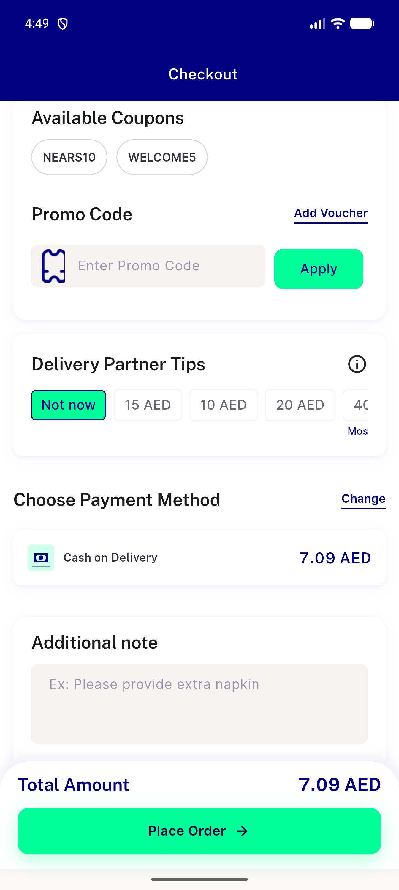
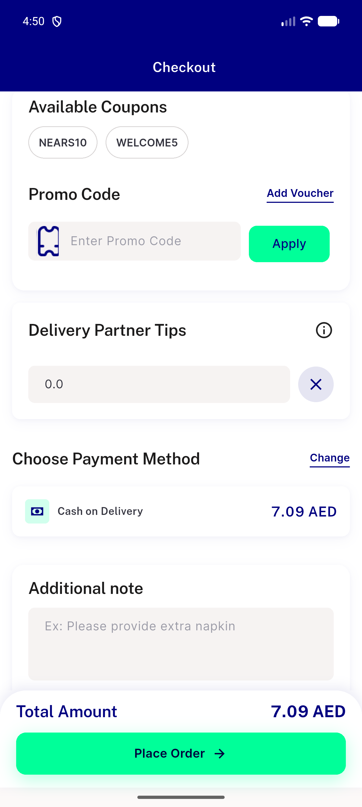

# QA Evidence — NEARS-2677

**PASS — checkout tips row font-scale overflow fix, LTR+RTL @1.0x/1.3x, 0 OVERFLOWING RenderFlex, clean logs**

**7 screenshot(s).** Click any thumbnail for full resolution.

<table>
<tr>
<td align="center" width="33%"> ac1 ltr 1.3x scrolled mosttipped</td>
<td align="center" width="33%"> ac1 ltr 1.3x</td>
<td align="center" width="33%"> ac2 rtl 1.3x scrolled mosttipped</td>
</tr>
<tr>
<td align="center" width="33%"> ac2 rtl 1.3x</td>
<td align="center" width="33%"> ac4 ltr 1.0x baseline</td>
<td align="center" width="33%"> ac4 rtl 1.0x baseline</td>
</tr>
<tr>
<td align="center" width="33%"> spotcheck custom tip field</td>
</tr>
</table>

---
*From `nears/docs/qa-evidence/NEARS-2677/` · public-repo scrub policy (no live secrets; verified clean).*
