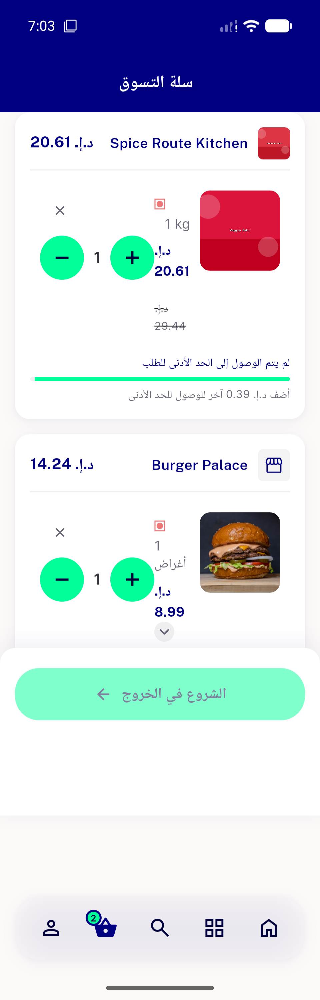
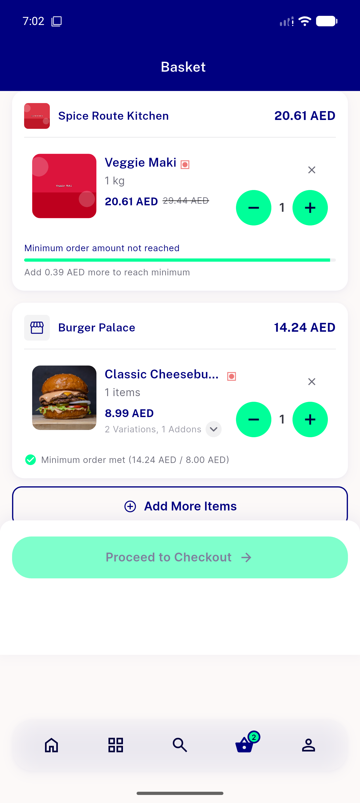
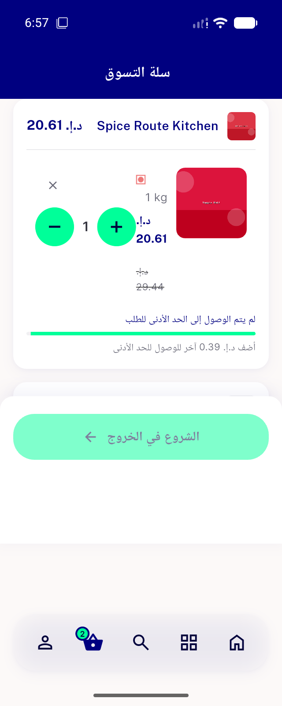

# QA Evidence — NEARS-2682

**PASS - cart toggle row overflow fix verified live (AR@320dp, EN/AR@448dp), 3/3 automated tests green**

**3 screenshot(s).** Click any thumbnail for full resolution.

<table>
<tr>
<td align="center" width="33%"> ac1 ac2 320dp ar toggle row</td>
<td align="center" width="33%"> ac3 en wide cart</td>
<td align="center" width="33%"> followup height overflow cart screen 261</td>
</tr>
</table>

---
*From `nears/docs/qa-evidence/NEARS-2682/` · public-repo scrub policy (no live secrets; verified clean).*
