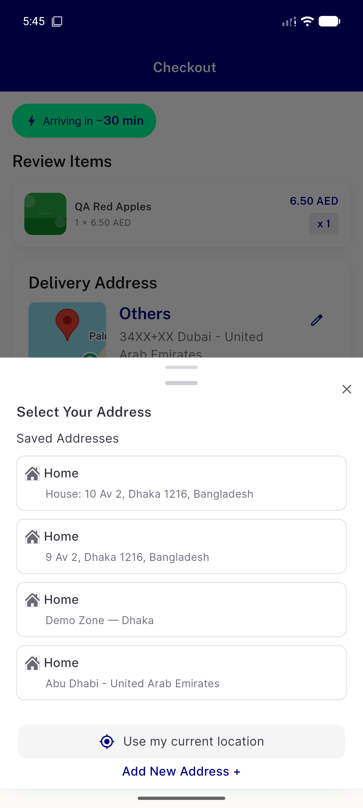

# QA Evidence — NEARS-2683

**PASS - checkout edit-address thumb-strip dead tap fixed, live-verified on emulator-5556**

**2 screenshot(s).** Click any thumbnail for full resolution.

<table>
<tr>
<td align="center" width="33%"> ac1 edit tap opens sheet</td>
<td align="center" width="33%"> ac2 ac3 checkout thumbstrip abudhabi</td>
</tr>
</table>

---
*From `nears/docs/qa-evidence/NEARS-2683/` · public-repo scrub policy (no live secrets; verified clean).*
