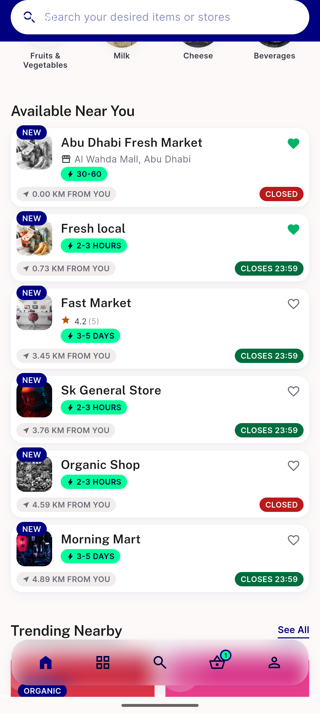
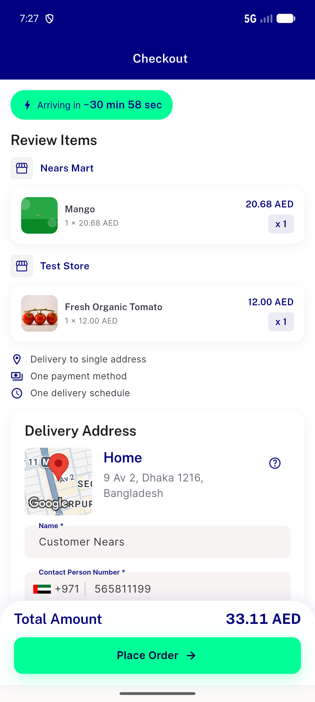

# QA Evidence — NEARS-2686

**PASS -- distance-api priming skip fix verified**

**2 screenshot(s).** Click any thumbnail for full resolution.

<table>
<tr>
<td align="center" width="33%"> ac2 real address home listing</td>
<td align="center" width="33%"> ac4 checkout real address</td>
</tr>
</table>

---
*From `nears/docs/qa-evidence/NEARS-2686/` · public-repo scrub policy (no live secrets; verified clean).*
