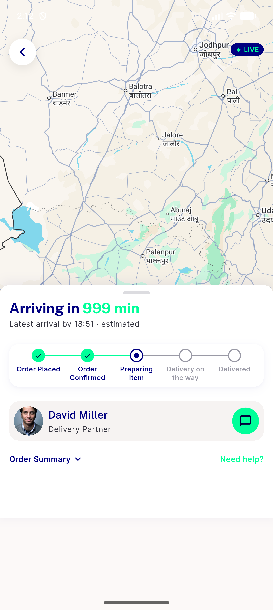
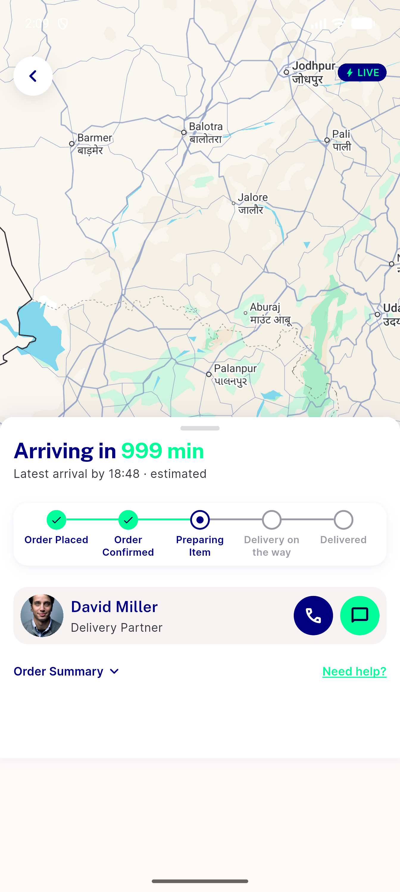
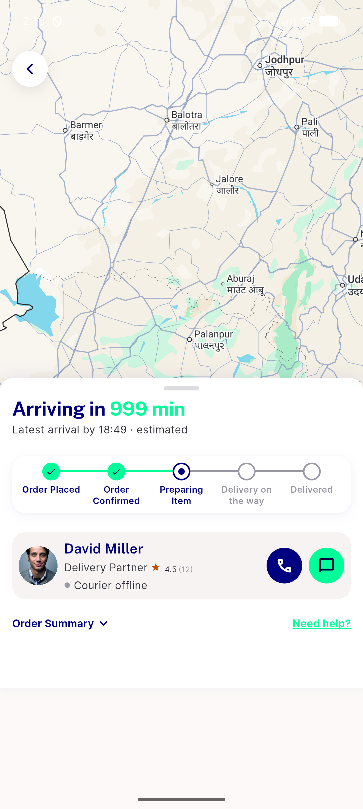
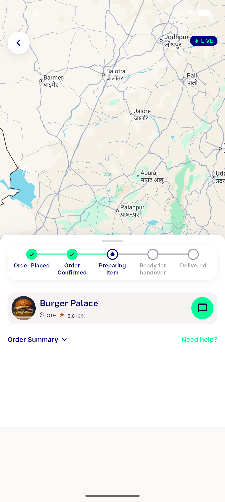
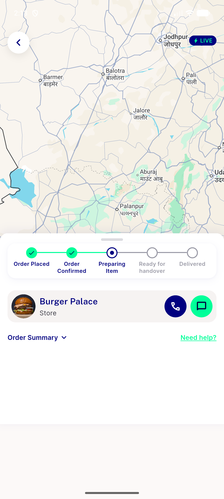

# QA Evidence — NEARS-2687

**PASS — NDriverCard host-slot decomposition: AC3 live-demonstrated both take_away/delivery branches, rating/courier-offline/call-withheld/chat conditionals; AC1/2/4 spot-confirmed; automated backstops 37/37 + 16/16 green**

**5 screenshot(s).** Click any thumbnail for full resolution.

<table>
<tr>
<td align="center" width="33%"> ac3 call withheld</td>
<td align="center" width="33%"> ac3 delivery base</td>
<td align="center" width="33%"> ac3 rating offline</td>
</tr>
<tr>
<td align="center" width="33%"> ac3 takeaway rating callwithheld</td>
<td align="center" width="33%"> ac3 takeaway store</td>
</tr>
</table>

---
*From `nears/docs/qa-evidence/NEARS-2687/` · public-repo scrub policy (no live secrets; verified clean).*
