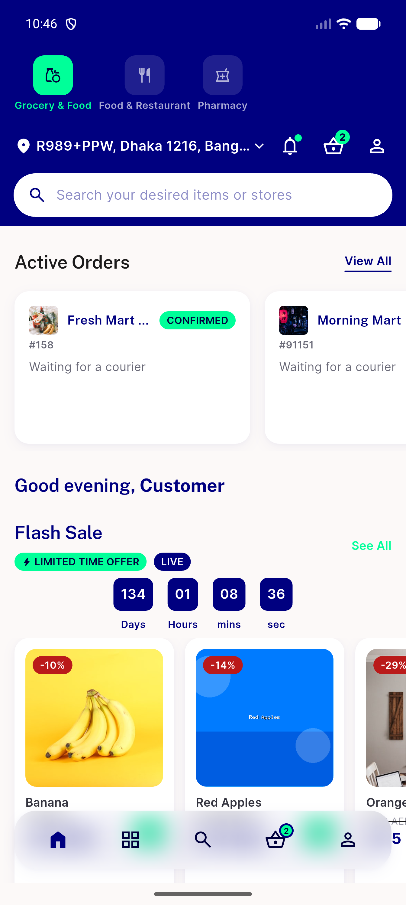
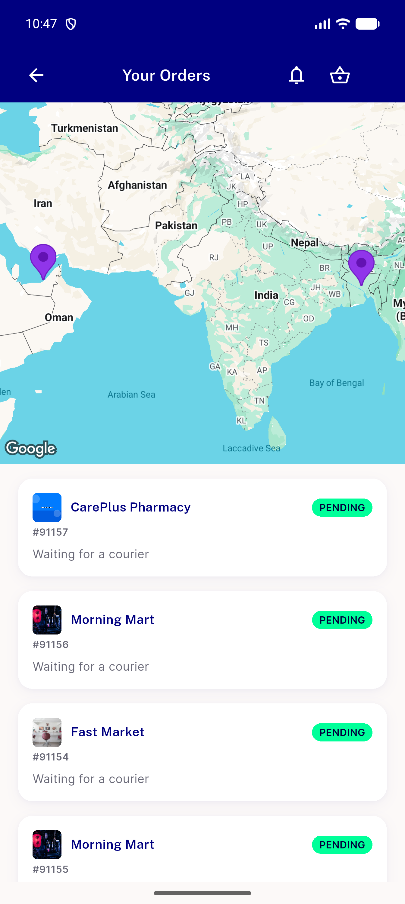

# QA Evidence — NEARS-2690

**PASS - live regression QA for getRunningOrders generation guard**

**2 screenshot(s).** Click any thumbnail for full resolution.

<table>
<tr>
<td align="center" width="33%"> home rail after rapid nav</td>
<td align="center" width="33%"> tracking hub</td>
</tr>
</table>

---
*From `nears/docs/qa-evidence/NEARS-2690/` · public-repo scrub policy (no live secrets; verified clean).*
