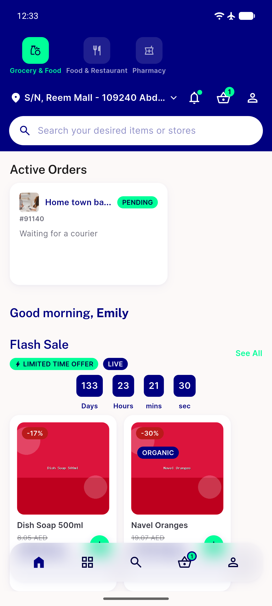

# QA Evidence — NEARS-2694

**PASS — DashboardScreen configModel null-safety hardening verified live, emulator-5558**

**1 screenshot(s).** Click any thumbnail for full resolution.

<table>
<tr>
<td align="center" width="33%"> ac2 dashboard normal login</td>
</tr>
</table>

### Other artifacts
- [`bug-distance-api-shape-invalid.log`](bug-distance-api-shape-invalid.log)

---
*From `nears/docs/qa-evidence/NEARS-2694/` · public-repo scrub policy (no live secrets; verified clean).*
