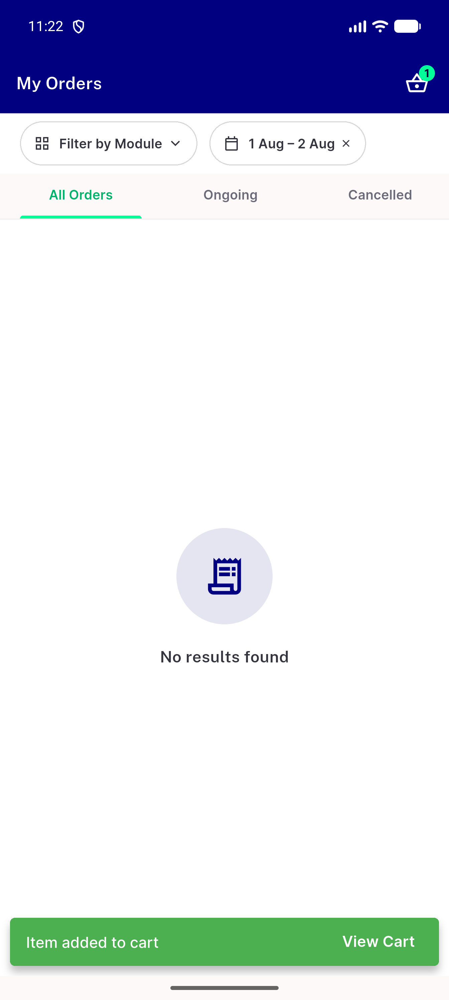
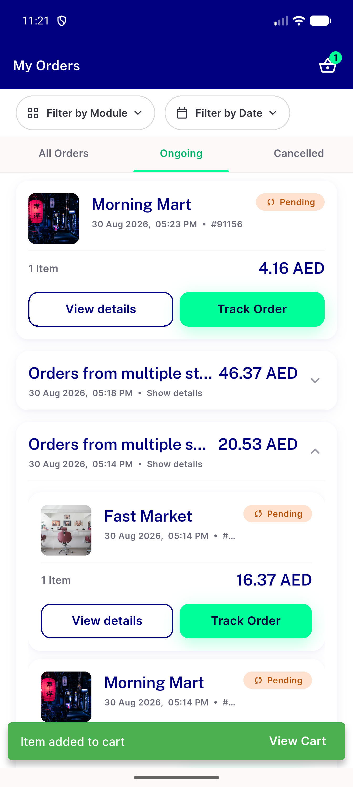
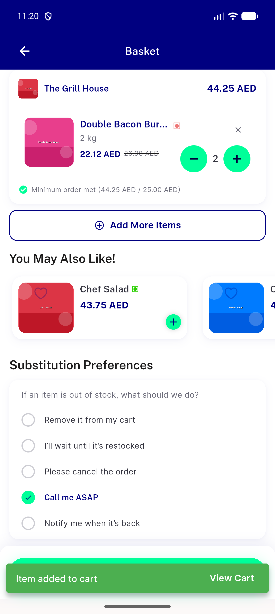
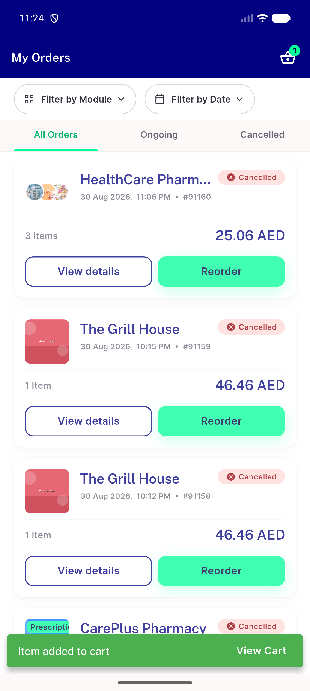
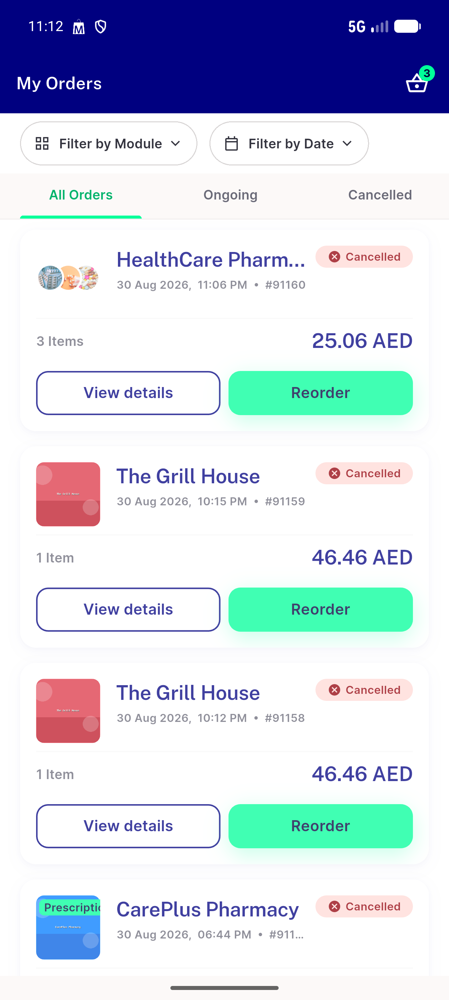
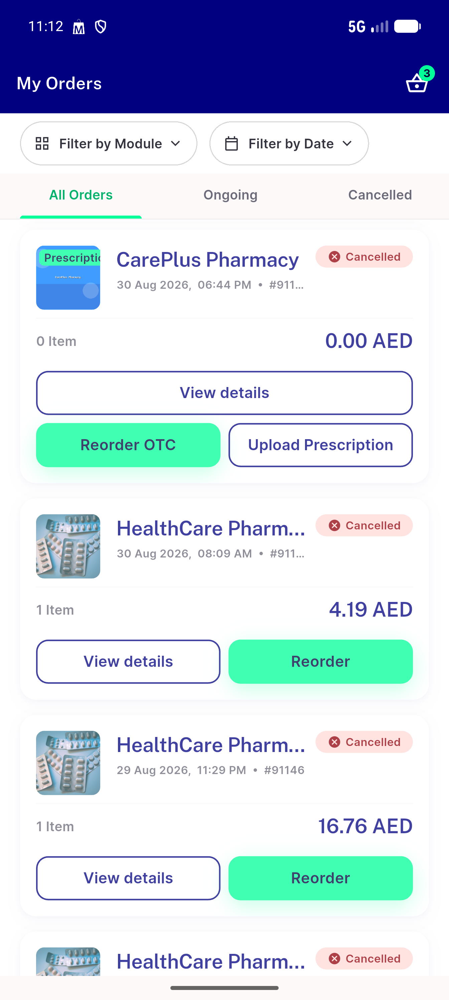
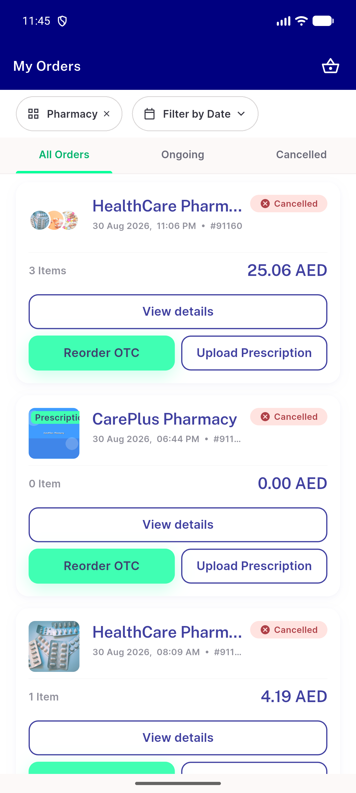

# QA Evidence — NEARS-2695

**delta re-QA fix-cycle 2: AC5/AC6 PASS on real order; new overbroad-split + stale-badge findings**

**9 screenshot(s).** Click any thumbnail for full resolution.

<table>
<tr>
<td align="center" width="33%"> ac filtered empty state no shop now</td>
<td align="center" width="33%"> ac1 order group accordion expanded</td>
<td align="center" width="33%"> ac4 food reorder cart</td>
</tr>
<tr>
<td align="center" width="33%"> ac8 error retry cleared</td>
<td align="center" width="33%"> bug 91160 mixed rx otc order shows plain reorder</td>
<td align="center" width="33%"> bug prescriptionOrder flag gates split not line items</td>
</tr>
<tr>
<td align="center" width="33%"> delta fix2 ac6 upload prescription routes store</td>
<td align="center" width="33%"> delta fix2 split now shows 91160 and overbroad 91147</td>
<td align="center" width="33%"> regression 2672 running order rail ok</td>
</tr>
</table>

---
*From `nears/docs/qa-evidence/NEARS-2695/` · public-repo scrub policy (no live secrets; verified clean).*
